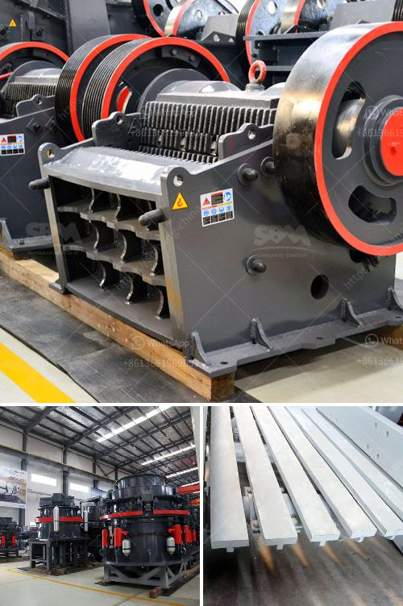

<h3>crusher concrete and stone</h3>
Crusher concrete and stone are two popular materials used in construction projects for various purposes. These materials are known for their durability, strength, and versatility, making them essential components in the construction industry.

Crusher concrete is a mixture of cement, sand, and water that hardens over time, creating a strong and durable material. It is commonly used as a foundational base for houses, buildings, and roads. The process of creating crusher concrete involves crushing large rocks and stones into smaller pieces, and then mixing them with other materials to form a solid substance.

Stone, on the other hand, is a naturally occurring material that has been used in construction for centuries. Stones are typically extracted from quarries and come in various shapes, sizes, and colors. They are commonly used as decorative elements in landscaping projects, such as walkways, patios, and garden features. Stones can also be crushed to create different sizes of aggregate for construction purposes.

One advantage of using crusher concrete and stone is their versatility. They can be used in a wide range of construction projects, from small residential renovations to large-scale commercial developments. Crusher concrete provides a stable and level foundation for structures, ensuring long-lasting durability. Stones, on the other hand, add aesthetic appeal to outdoor spaces, enhancing the overall beauty of a property.

Not only are crusher concrete and stone versatile, but they are also eco-friendly options. The use of these materials reduces the need for new resources, such as gravel and sand, which helps protect the environment. Additionally, crusher concrete and stone can be recycled and reused in other construction projects, further reducing waste and promoting sustainability.

In conclusion, crusher concrete and stone are valuable materials in the construction industry due to their durability, strength, versatility, and eco-friendliness. Whether used as a solid foundation or as decorative elements, these materials play a crucial role in enhancing the quality and longevity of construction projects.
<h3>Contact us</h3><ul><li><strong>Whatsapp:&nbsp;<a href="https://wa.me/8613661969651">+8613661969651</a></strong></li><li><a href="https://swt.shibang-china.com/?git&amp;zhl&amp;crusher concrete and stone"><strong>Online Service(chat now)</strong></a></li></ul><h3>Related</h3><ul><li><a href='ball mill for silica sand.md'>ball mill for silica sand</a></li><li><a href='sale for stone crusher.md'>sale for stone crusher</a></li><li><a href='grinding equipment for cement plant.md'>grinding equipment for cement plant</a></li><li><a href='oman marble quarry companies.md'>oman marble quarry companies</a></li><li><a href='china roller mill kenya.md'>china roller mill kenya</a></li></ul>