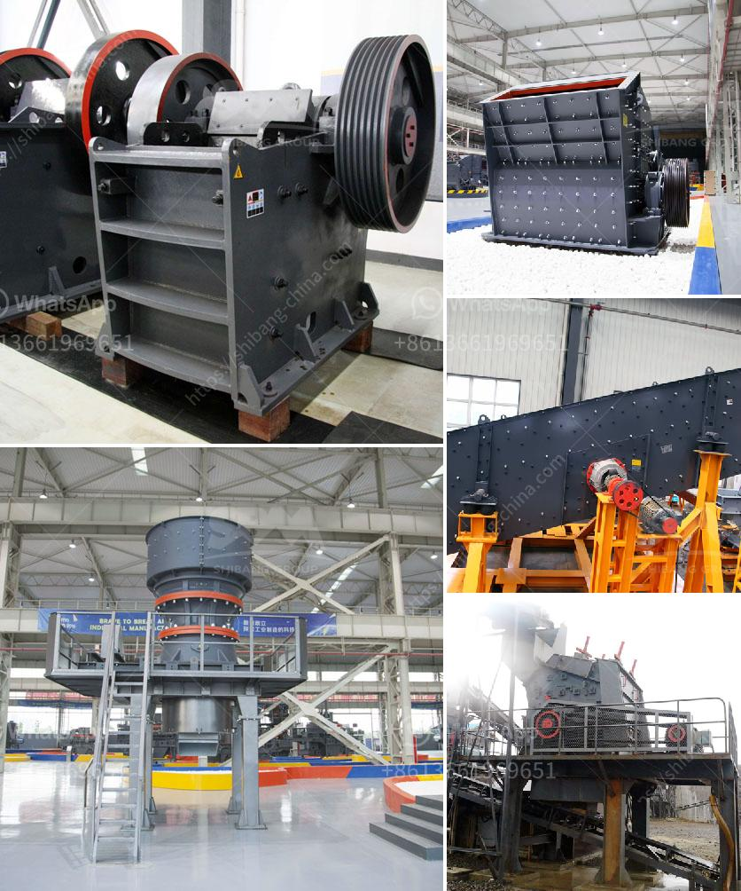

<h3>crusher concrete kuwait</h3>
In today's rapidly urbanizing world, the construction industry continues to burgeon as cities expand and infrastructural needs multiply. With this surge in construction projects, the need for efficient and sustainable building materials has become paramount. One such material that has gained popularity in recent years is crusher concrete, which has found wide usage in Kuwait's booming construction sector.

Crusher concrete, also known as recycled concrete aggregate (RCA), is made from crushing concrete debris generated from demolition and construction activities. Traditionally, concrete waste is discarded in landfills, causing environmental concerns and wasting valuable resources. However, with the advancements in technology, crusher concrete provides a viable solution to these issues.

The utilization of crusher concrete offers numerous benefits for construction in Kuwait. Firstly, it significantly reduces the need for extracting and processing natural aggregates like sand and gravel. By using crusher concrete, the demand for these finite resources is minimized, conserving Kuwait's natural resources for future generations.

Moreover, using crusher concrete in construction projects reduces carbon emissions and environmental impact. The production of traditional concrete involves mining, transportation, and processing of raw materials, resulting in considerable energy consumption and greenhouse gas emissions. In contrast, crusher concrete utilizes pre-existing materials, reducing the reliance on energy-intensive production processes.

Additionally, crusher concrete offers enhanced durability and resilience compared to traditional concrete. The crushing process results in a well-graded aggregate, which possesses superior strength and performance characteristics. This durability translates into longer-lasting structures, reducing maintenance and repair costs over time.

Furthermore, crusher concrete helps to address the waste management challenges associated with construction activities. By recycling concrete waste, the volume of material sent to landfills is reduced, mitigating the strain on existing waste management systems and minimizing pollution risks.

Kuwait's construction industry has embraced the use of crusher concrete due to its proven benefits. Contractors, builders, and developers recognize the value of this sustainable material in meeting project requirements while minimizing environmental impact.

In conclusion, crusher concrete is playing a significant role in enhancing construction efficiency and sustainability in Kuwait. By repurposing concrete waste and minimizing the use of natural resources, this innovative building material provides a viable solution for the construction industry's needs. As Kuwait continues to develop and expand, the adoption of crusher concrete will undoubtedly contribute to a more sustainable and greener construction sector.
<h3>Contact us</h3><ul><li><strong>Whatsapp:&nbsp;<a href="https://wa.me/8613661969651">+8613661969651</a></strong></li><li><a href="https://swt.shibang-china.com/?git&amp;zhl&amp;crusher concrete kuwait"><strong>Online Service(chat now)</strong></a></li></ul><h3>Related</h3><ul><li><a href='gypsum import from bhutan.md'>gypsum import from bhutan</a></li><li><a href='sell jaw crusher the dubia.md'>sell jaw crusher the dubia</a></li><li><a href='used iron ore jaw crusher price nigeria.md'>used iron ore jaw crusher price nigeria</a></li><li><a href='ball mill machine india.md'>ball mill machine india</a></li><li><a href='used hammer mill for sale.md'>used hammer mill for sale</a></li></ul>