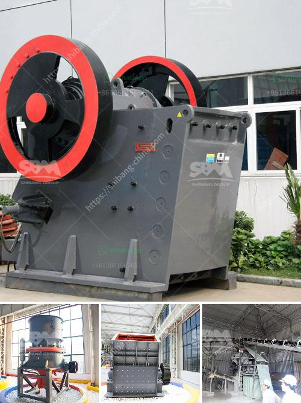

<h3>crusher equipment dubai</h3>
Crusher equipment plays an indispensable role in the construction industry, particularly in the emirate of Dubai. It is an essential tool for the production of aggregates used in various construction projects such as roads, bridges, buildings, and residential communities. In this article, we will explore the importance of crusher equipment in Dubai and how it has contributed to the growth of the city's construction sector.

Dubai, being one of the fastest-growing cities in the world, has witnessed significant infrastructure development over the years. With ambitious projects like the Dubai Expo 2020 and the construction of the Dubai Metro, the demand for construction materials, especially aggregates, has skyrocketed. This surge in demand has necessitated the use of crusher equipment, which plays a critical role in the production of these essential construction materials.

Crusher equipment, commonly known as crushers, are machines designed to reduce large rocks into smaller rocks, gravel, or rock dust. Crushers are used to break down stones and rocks into fine particles, making it easier to transport and use them in various construction applications. The most common types of crushers used in Dubai include jaw crushers, cone crushers, impact crushers, and hammer crushers.

One of the significant advantages of crusher equipment is its versatility. It can be used to crush a wide range of materials, including concrete, rocks, marble, and limestone. This versatility allows contractors to produce different types of aggregates, such as sand, gravel, and crushed stone, to meet the specific requirements of different construction projects.

In addition to its versatility, crusher equipment in Dubai is known for its efficiency and productivity. Modern crushers are equipped with advanced technologies that enable them to process large volumes of materials in a short period. This high productivity ensures that construction projects are completed on time and within budget, contributing to the overall development of the city.

Moreover, crusher equipment in Dubai is designed to be environmentally friendly. Many crushers are equipped with dust suppression systems that minimize the release of harmful particles into the air, ensuring a cleaner and healthier working environment for construction workers. Additionally, many crushers are powered by renewable energy sources such as solar or wind power, further reducing their carbon footprint.

The availability of crusher equipment in Dubai has also stimulated job opportunities within the construction sector. The operation and maintenance of crushers require skilled workers, creating employment opportunities for individuals with expertise in operating heavy machinery. This has contributed to the growth of the local workforce and the overall economy of Dubai.

In conclusion, crusher equipment in Dubai has become an integral part of the construction industry, enabling the production of high-quality aggregates for various construction projects. Its versatility, efficiency, and environmental friendliness have made it an indispensable tool for contractors and developers in the emirate. As Dubai continues its rapid development, the demand for crusher equipment will only increase, further fueling the growth of the construction sector and the city as a whole.
<h3>Contact us</h3><ul><li><strong>Whatsapp:&nbsp;<a href="https://wa.me/8613661969651">+8613661969651</a></strong></li><li><a href="https://swt.shibang-china.com/?git&amp;zhl&amp;crusher equipment dubai"><strong>Online Service(chat now)</strong></a></li></ul><h3>Related</h3><ul><li><a href='hammer mill in malaysia.md'>hammer mill in malaysia</a></li><li><a href='mining crusher plant limestone process.md'>mining crusher plant limestone process</a></li><li><a href='crushing stones for gold.md'>crushing stones for gold</a></li><li><a href='oman marble quarry companies.md'>oman marble quarry companies</a></li><li><a href='robo sand machinery cost manufactures.md'>robo sand machinery cost manufactures</a></li></ul>