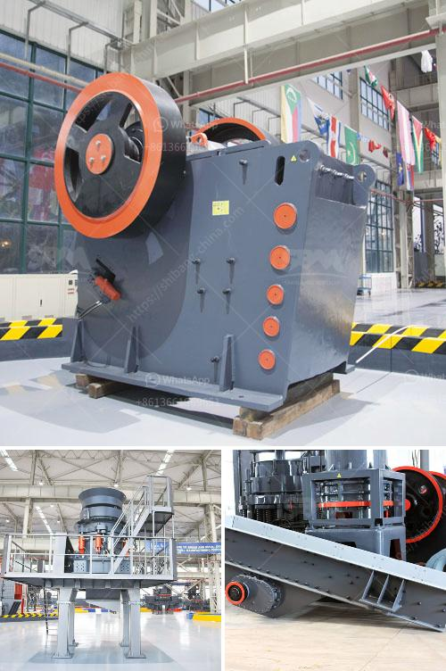

<h3>crusher for crushing calcium carbonate</h3>
Calcium carbonate is a chemical compound that is widely used in various industries. It is an economical and practical filler and coating agent, extensively used in the plastics, rubber, paper, paints, and coatings industries. Calcium carbonate has been greatly utilized as an essential raw material in the construction, agriculture, and pharmaceutical industries as well. Its wide range of applications is attributed to its versatility and beneficial properties, making it an indispensable ingredient in various products.

One crucial step in processing calcium carbonate is crushing the limestone or chalk (calcium carbonate) to a specific size range. Proper sizing can enhance the solubility of calcium carbonate and allow it to be incorporated into a wide range of products efficiently. This is where crushers come in.

A crusher is a machine that breaks large rocks into smaller pieces, reducing them to the required size. Crushers are used to reduce the size of materials for further processing, eliminating waste and improving efficiency. As calcium carbonate is an essential component of many materials, a crusher for calcium carbonate is crucial for the mining industry.

Calcium carbonate through crusher is widely used as the raw material in plastics, rubber, paper, toothpaste, cosmetics, and building materials, etc. The industrial powder grinder is also essential in many industries. What you must know is that calcium carbonate crusher is not only applicable to limestone, but also to other rocks with a Mohs hardness of ≤7 and humidity of ≤6%.

Besides, it can deal with various ore materials such as iron ore, copper ore, gold ore, and much more. This type of crusher has a large crushing ratio and a high crushing efficiency, making it quite suitable for crushing calcium carbonate as well as other mineral raw materials.

The cost of building calcium carbonate factories tends to be highly aggregated, whereas the costs of producing finishing powder products are relatively low. Therefore, adopting the roller mill or the vertical mill is the main choice for calcium carbonate grinding.

Compared with other calcium carbonate grinding mills, ball mill and vertical mill are more widely used in manufacturing of calcium carbonate powder. In the following chart, we will outline the pros and cons of both ball mill and vertical mill for calcium carbonate plant.

Ball mill is often used for grinding silica sand. The ball mill for grinding calcium carbonate consumes less energy than other ordinary ball mills. It can grind various ores and other materials in dry and wet methods. It is suitable for both batch and continuous operation. As well, it is suitable for open and closed-circuit grinding and is applicable for materials of all degrees of hardness.

Vertical mill is a high-speed air swept swing hammer mill used to pulverize materials in the extreme fineness range. The principle of integral air classification, originally developed by Raymond, has been applied with outstanding success to this mill. As a result, a large number of equipment has been installed in recent years.

With its pulverized coal samples from a hammer mill, it is possible to estimate power requirements for a desired throughput rate. This can be predicted from the size distribution of the product, the coal mass flow rate, and the Hamming distance matrix. Moreover, vertical mills are capable of handling feed sizes up to 50 mm and grinding to products less than 10 µm.

In conclusion, choosing a suitable calcium carbonate crusher and grinding mill is significant in ensuring the success of your quarry project. Overall, considering the cost of limestone mining projects, the cost of calcium carbonate crusher and grinding mill is relatively low. So far, our calcium carbonate grinding mill has been sold to more than 60 countries and regions worldwide, with excellent quality and affordable price. It is an ideal choice for grinding calcium carbonate.
<h3>Contact us</h3><ul><li><strong>Whatsapp:&nbsp;<a href="https://wa.me/8613661969651">+8613661969651</a></strong></li><li><a href="https://swt.shibang-china.com/?git&amp;zhl&amp;crusher for crushing calcium carbonate"><strong>Online Service(chat now)</strong></a></li></ul><h3>Related</h3><ul><li><a href='gold mining project cost.md'>gold mining project cost</a></li><li><a href='gypsum board manufacturing.md'>gypsum board manufacturing</a></li><li><a href='limestone impact crusher.md'>limestone impact crusher</a></li><li><a href='business plan for a quarry crusher.md'>business plan for a quarry crusher</a></li><li><a href='stone crusher equipment manufacturer.md'>stone crusher equipment manufacturer</a></li></ul>