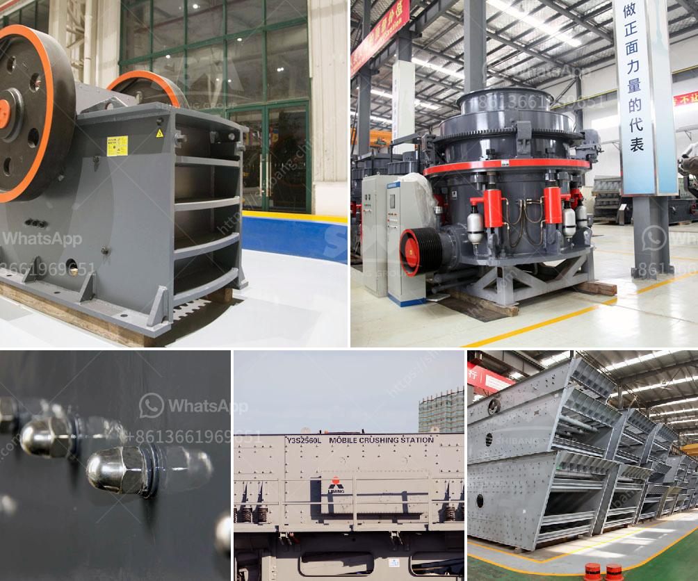

<h3>crusher for marble</h3>
Marble is a mesmerizing natural stone that has been highly valued for its exquisite beauty and exceptional durability for centuries. Quarried from mountains across the world, marble is sought after for its unique veining patterns and soft color tones that can range from pure white to deep black. However, transforming marble from its raw form into marketable sizes requires the use of specialized equipment, including crushers specifically designed for marble crushing.

A crusher for marble is a large machine that is designed to take large marble rocks and crush them into smaller pieces suitable for use in various industries such as construction, masonry, and architecture. These crushers consist of a heavy-duty steel drum that relies on both hydraulic and mechanical forces to pulverize the marble rocks into granular sizes.

The first stage in the marble crushing process involves feeding the large marble rocks into the crusher's hopper. This is usually done using a vibrating feeder that evenly distributes the rocks into the crushing chamber. Once in the chamber, the marble rocks are subjected to intense pressure and impact from the crusher's rotating hammers or jaws, depending on the type of crusher.

In most cases, a jaw crusher is preferred for crushing marble due to its ability to provide a uniform and precise reduction in size. The jaws of the crusher exert force on the marble rocks, breaking them into smaller pieces. Some jaw crushers also have a reciprocating motion, which further enhances the crushing process by exerting additional pressure on the rocks.

For larger marble rocks, a cone crusher may be used instead. Cone crushers operate by squeezing the marble rocks between a revolving cone and a fixed wall. This type of crusher is highly efficient in reducing large rocks into smaller and more manageable sizes. However, cone crushers are typically used in industrial settings where a higher throughput is required.

The size and quality of the crushed marble produced by these crushers are determined by the crusher's settings, as well as the hardness and composition of the marble rocks. The output can vary from fine to coarse depending on the specific requirements of the end-users.

Crushers for marble also play a crucial role in the recycling of waste marble slabs and offcuts, turning them into reclaimed materials that can be used for new applications. By crushing and reusing marble waste, the industry reduces its environmental impact and conserves natural resources.

In conclusion, a crusher for marble is an essential piece of equipment in the marble industry. It allows quarry operators to effectively transform quarried marble into marketable sizes suitable for a wide range of applications. These crushers provide the industry with a highly efficient and sustainable solution, reducing waste and maximizing the value of this magnificent natural stone.
<h3>Contact us</h3><ul><li><strong>Whatsapp:&nbsp;<a href="https://wa.me/8613661969651">+8613661969651</a></strong></li><li><a href="https://swt.shibang-china.com/?git&amp;zhl&amp;crusher for marble"><strong>Online Service(chat now)</strong></a></li></ul><h3>Related</h3><ul><li><a href='ball mill in copper plant.md'>ball mill in copper plant</a></li><li><a href='sale for stone crusher.md'>sale for stone crusher</a></li><li><a href='quotations for stone crushers.md'>quotations for stone crushers</a></li><li><a href='raymond mill for sale.md'>raymond mill for sale</a></li><li><a href='stone crusher machine price in south africa.md'>stone crusher machine price in south africa</a></li></ul>