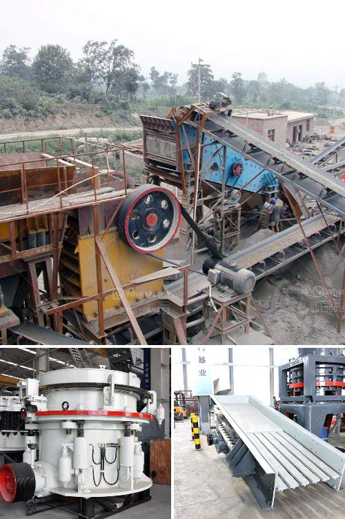

<h3>crusher for sale in nigeria</h3>
Crusher machines are used to crush various materials, namely rocks, ore, and other aggregates for the purpose of industrial use. Crushers are commonly classified by the degree to which they fragment the starting material, with primary and secondary crushers handling coarse materials, and tertiary and quaternary crushers reducing ore particles to finer gradations.

In Nigeria, the importance of the mining industry is evident. There are several large and small-scale mines found across the country which, over the years, have significantly contributed to the nation's economic growth. With the increasing demand for minerals, crushers are becoming more essential in the mining industry.

Crushers for sale are typically available in three distinct types, namely, jaw crusher, impact crusher, and cone crusher. Jaw crushers are usually used in primary crushing stages, while cone crushers are used in secondary and tertiary crushing applications. Impact crushers can be used in both primary and secondary crushing stages.

To choose the right crusher for sale in Nigeria, it is vital to consider the product's material requirements, shape, application, and geographical location of the project. Considering these factors, it is essential to choose an efficient and reliable crusher machine, and the most popular ones are jaw crusher, cone crusher, and impact crusher.

The jaw crusher is a versatile type of crushing equipment, which is to destroy the pieces of material using the principle of compression cheeks. This type of crusher is available in all classes of fragmentation: small, medium, and large-scale. Primary mobile crushing plants stimulate the jaw crusher machine due to their effective and efficient working capacity.

The cone crushers can perform secondary and tertiary crushing functions, with the primary difference being the shape of the crushing chambers. The reduction ratio for a cone crusher is typically 6:1 to 4:1.

Lastly, the impact crusher is used for the final shaping of stones as it helps to achieve the cubic shape of the desired product. Impact crushers do not use pressure to crush rocks but rather employ impact. The material is placed in a cage where an impact is applied, thus breaking it into smaller pieces.

Crushers for sale in Nigeria are available in both stationary and mobile types, including jaw crushers, cone crushers, impact crushers, and VSIs. However, knowing the right vendor to purchase from is equally important, especially when considering affordability, quality, and convenience.
<h3>Contact us</h3><ul><li><strong>Whatsapp:&nbsp;<a href="https://wa.me/8613661969651">+8613661969651</a></strong></li><li><a href="https://swt.shibang-china.com/?git&amp;zhl&amp;crusher for sale in nigeria"><strong>Online Service(chat now)</strong></a></li></ul><h3>Related</h3><ul><li><a href='tonne stone crusher cost sale.md'>tonne stone crusher cost sale</a></li><li><a href='stone crushing turkey.md'>stone crushing turkey</a></li><li><a href='mining equipment made in germany.md'>mining equipment made in germany</a></li><li><a href='what is a mobile crusher.md'>what is a mobile crusher</a></li><li><a href='mobile chrome wash plant for sale.md'>mobile chrome wash plant for sale</a></li></ul>