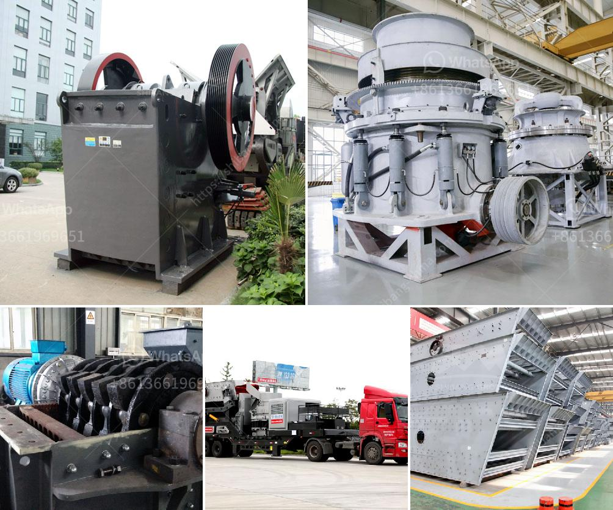

<h3>crusher from china price</h3>
China's industrial sector has always been renowned for its efficiency and dedication to providing high-quality machinery to various industries worldwide. One such product that stands out is the crusher equipment. China boasts an extensive range of crushers, from jaw crushers and impact crushers to cone crushers and hammer crushers. These machines have gained popularity due to their robust construction, reliable performance, and cost-effectiveness. With prices that won't break the bank, Chinese crushers have become a go-to choice for businesses worldwide.

Chinese crusher manufacturers, leveraging their vast experience and advanced technology, offer a wide range of crushers suitable for various applications. Whether you are in the mining, construction, or recycling industry, there is a crusher from China that will meet your specific needs. These machines are designed to crush different types of materials, including rocks, ores, minerals, and construction waste.

One of the key factors that make Chinese crushers stand out is their competitive pricing. The Chinese manufacturers are committed to offering quality machinery at affordable rates, enabling businesses of all sizes to invest in reliable crushing equipment. The cost-effectiveness of Chinese crushers has made them an attractive option for both large corporations and small-scale enterprises, seeking to expand their operations while adhering to budget constraints.

Additionally, the crusher prices from China are often lower than those from other regions. Chinese manufacturers achieve this by implementing streamlined production processes, efficient supply chain management, and economies of scale. They have mastered the art of producing high-quality crushers without compromising on cost. By minimizing production costs, Chinese manufacturers pass the benefits onto their customers, offering machinery at competitive prices.

However, it is essential to note that the lower price does not imply a compromise on quality. Chinese manufacturers prioritize quality control and adhere to international standards. They employ innovative technologies and high-grade materials to manufacture crushers that are durable, efficient, and perform optimally in various operating conditions. These crushers undergo rigorous testing to ensure that they can withstand the most demanding applications.

Before investing in Chinese crushers, it is crucial to conduct research and due diligence. Identify reliable and reputable manufacturers with a proven track record. Read customer reviews, analyze the technical specifications, and evaluate the after-sales support offered by the manufacturer. By doing so, you can ensure that you are investing in a crusher that meets your requirements while staying within your budget.

In conclusion, when it comes to finding a crusher at an affordable price without compromising on quality, China is an ideal destination. Chinese manufacturers offer a diverse range of crushers suitable for various industries, including mining, construction, and recycling. The competitive pricing of Chinese crushers makes them an excellent choice for businesses looking to expand their operations while minimizing costs. However, it is crucial to conduct proper research and due diligence before making a purchase to ensure that you are investing in a reliable and high-quality crusher that will meet your specific needs.
<h3>Contact us</h3><ul><li><strong>Whatsapp:&nbsp;<a href="https://wa.me/8613661969651">+8613661969651</a></strong></li><li><a href="https://swt.shibang-china.com/?git&amp;zhl&amp;crusher from china price"><strong>Online Service(chat now)</strong></a></li></ul><h3>Related</h3><ul><li><a href='limestone beneficiation.md'>limestone beneficiation</a></li><li><a href='which roller stand in milling industry.md'>which roller stand in milling industry</a></li><li><a href='100tpd cement mill manufacturers.md'>100tpd cement mill manufacturers</a></li><li><a href='jaw crushers price.md'>jaw crushers price</a></li><li><a href='mining crusher plant limestone process.md'>mining crusher plant limestone process</a></li></ul>