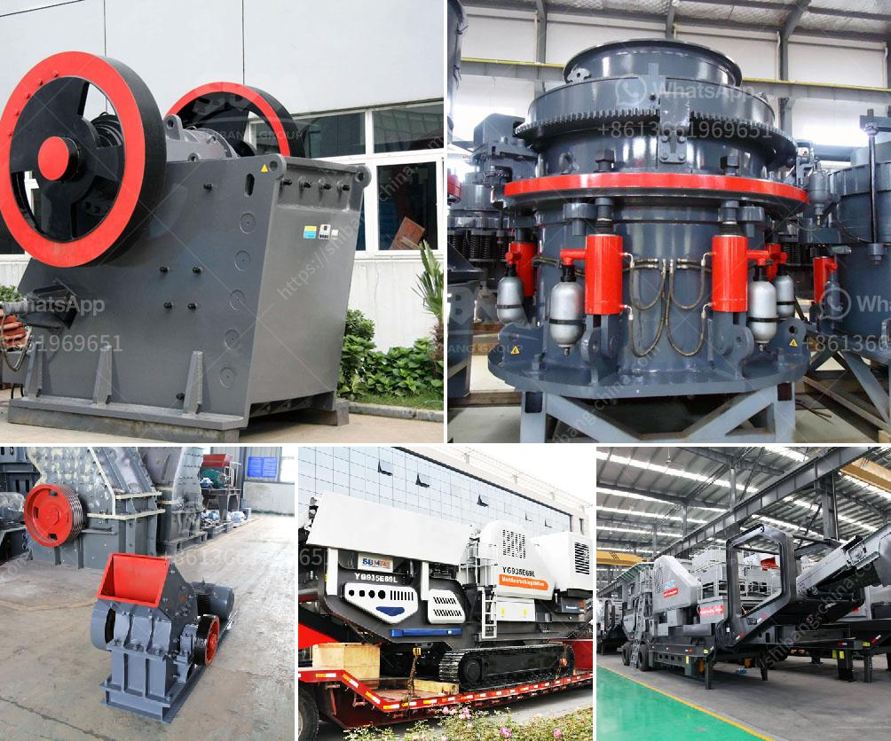

<h3>crusher from china</h3>
China is a country rich in mineral resources and with a booming infrastructure sector, crushing has become an integral part of many construction projects. As the main component of various types of construction waste, crushing is the key to the efficient utilization of resources and successful project completion. In this article, we will take a closer look at crushers from China and explore their features and benefits.

China is well-known for its high-quality crushers, which are designed to crush a wide range of materials to a desired size. They can be used for various applications such as in mining, quarrying, recycling, and construction. With years of experience and technological advancements, Chinese crushers have become more efficient and reliable, making them popular choices worldwide.

One of the key features of crushers from China is their versatility. They can handle a wide range of materials, including hard and soft rocks, ores, minerals, and construction waste. This means that whether you are processing materials for road construction, building demolition, or recycling, there is a crusher from China designed to meet your specific needs.

Another notable feature of Chinese crushers is their durability. Constructed with high-quality materials and built to withstand heavy-duty use, these crushers are designed to last. This is particularly important in demanding applications where crushers are exposed to extreme conditions and require continuous operation. With regular maintenance and proper care, Chinese crushers can deliver long-lasting performance, reducing the need for frequent replacements and minimizing downtime.

Chinese crushers also come with advanced technological features that enhance their efficiency and productivity. Many crushers from China are equipped with automated systems, allowing for easy control and monitoring of the crushing process. These systems can be integrated with computerized programs, ensuring precise and consistent crushing results every time.

Furthermore, Chinese crushers are often more cost-effective compared to their counterparts from other countries. With a competitive pricing strategy and a focus on delivering value for money, Chinese manufacturers have gained a strong foothold in the global market. This has made crushers from China an attractive option for contractors and project managers looking to optimize their budgets without compromising on quality.

In conclusion, crushers from China are playing a crucial role in the construction industry by efficiently crushing various materials to the desired size. Their versatility, durability, and advanced technological features make them ideal for a wide range of applications. Additionally, their cost-effectiveness and exceptional performance make them a popular choice among contractors around the world. Therefore, if you are in need of reliable crushers that offer value for money, consider exploring the offerings from China.
<h3>Contact us</h3><ul><li><strong>Whatsapp:&nbsp;<a href="https://wa.me/8613661969651">+8613661969651</a></strong></li><li><a href="https://swt.shibang-china.com/?git&amp;zhl&amp;crusher from china"><strong>Online Service(chat now)</strong></a></li></ul><h3>Related</h3><ul><li><a href='cara menghitung kapasitas pada belt conveyor.md'>cara menghitung kapasitas pada belt conveyor</a></li><li><a href='kenya cone crusher is manufactured.md'>kenya cone crusher is manufactured</a></li><li><a href='marble and granite plant.md'>marble and granite plant</a></li><li><a href='almeida stone crusher.md'>almeida stone crusher</a></li><li><a href='kaolin crusher price.md'>kaolin crusher price</a></li></ul>