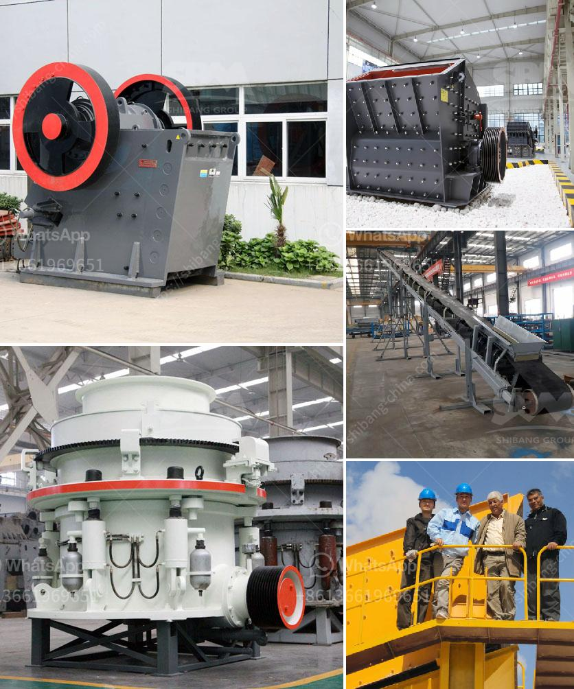

<h3>crusher in china</h3>
The Crusher Industry in China is experiencing a boom period. With the rapid development of infrastructure projects and increasing urbanization, the demand for crushers is skyrocketing. As a key market for crushing and screening equipment, China plays a vital role in the global economy.

Crushers are machines used to break large rocks into smaller pieces, which are then used for construction and other purposes. They are categorized into different types such as jaw crushers, cone crushers, impact crushers, and others. China is a major producer and consumer of crushers, accounting for a significant share of the global market.

One of the key factors driving the growth of the crusher industry in China is the country's massive investment in infrastructure projects. The Chinese government has been investing heavily in the construction of roads, railways, airports, and other infrastructure to support economic growth. This has created a huge demand for crushers to process large quantities of rocks and stones needed for these projects.

Furthermore, China's urbanization process has also propelled the expansion of the crusher industry. As more rural areas undergo urbanization, there is a need for new buildings, roads, and other infrastructure in these regions. The demand for crushers is particularly high in these areas for crushing and processing materials required for construction.

Additionally, with the increasing focus on environmental protection, the crusher industry in China is also undergoing significant transformations. Chinese authorities have implemented stricter regulations and policies to promote sustainable development in the industry. This has prompted crusher manufacturers to develop more environmentally friendly and energy-efficient equipment to comply with the regulations. As a result, there has been a surge in the adoption of advanced technologies in the manufacturing and operation of crushers in China.

Moreover, China's rapid economic growth and rising middle-class population have also contributed to the growing demand for crushers. As disposable incomes increase, there is a rise in consumer spending on infrastructure and real estate, further fueling the need for crushers.

However, the rapid expansion of the crusher industry in China has also raised concerns regarding overcapacity and environmental issues. Some regions in China have witnessed the excessive development of crusher plants, leading to a surplus of production capacity. This has resulted in price wars among manufacturers, negatively impacting the overall profitability of the industry.

Addressing environmental concerns, the Chinese government has implemented stringent regulations to control pollution caused by the crusher industry. Manufacturers are required to comply with emissions standards and invest in pollution control measures. This has forced many small and less efficient crushers to shut down or upgrade their facilities, leading to industry consolidation and improved environmental performance.

In conclusion, the crusher industry in China is experiencing remarkable growth due to the country's infrastructure projects, urbanization, and focus on environmental sustainability. The demand for crushers is expected to continue to rise as China strives for further development and modernization. However, it is crucial for both government and industry stakeholders to address challenges related to overcapacity and environmental impacts to ensure the sustainability and prosperity of the crusher industry in China.
<h3>Contact us</h3><ul><li><strong>Whatsapp:&nbsp;<a href="https://wa.me/8613661969651">+8613661969651</a></strong></li><li><a href="https://swt.shibang-china.com/?git&amp;zhl&amp;crusher in china"><strong>Online Service(chat now)</strong></a></li></ul><h3>Related</h3><ul><li><a href='how to make talcum powder in the escapists.md'>how to make talcum powder in the escapists</a></li><li><a href='cone crusher supply.md'>cone crusher supply</a></li><li><a href='iron processing equipment cost.md'>iron processing equipment cost</a></li><li><a href='equipment necessary to exploiting a quarry.md'>equipment necessary to exploiting a quarry</a></li><li><a href='rock processing plant.md'>rock processing plant</a></li></ul>