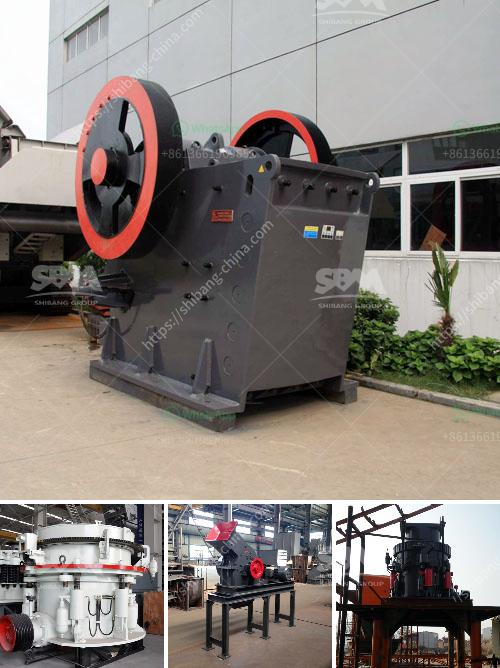

<h3>crusher machine for crusher machine for sale</h3>
In today's industrial world, one thing is consistent - the need for crushing machines. With the heavy demands of the mining and aggregate industries, crushers have become essential to the efficient and reliable functioning of these sectors. To cater to this growing need, crusher machine manufacturers have come up with a vast range of options for sale, each designed to save time and energy in crushing materials.

One of the most popular crusher machines being sold is the jaw crusher. This machine is typically used for primary crushing purposes, as it boasts a high processing capacity and reliable performance. Additionally, the jaw crusher is also equipped with a vibrating feeder, which ensures that the material is evenly fed into the crusher. This further enhances its efficiency as the crusher can process the material smoothly without any interruptions.

Another popular option for sale is the cone crusher. This machine is known for its ability to produce high-quality end products, making it ideal for the aggregate industry. It works by squeezing the material between an eccentrically rotating cone and a concave hopper, ensuring that the final product is uniform and precise.

The impact crusher is also worth considering for those in need of a versatile crushing solution. This machine utilizes the principle of high-speed impact to effectively crush materials. With its compact size and robust design, the impact crusher is suitable for both primary and secondary crushing applications. It has the added advantage of being easy to maintain and repair, making it a cost-effective choice for businesses.

When purchasing a crusher machine for sale, one must consider factors such as production capacity, power consumption, and ease of maintenance. It is advisable to choose a machine that meets your specific requirements, ensuring that it will optimize your production line and maximize your profit.

In conclusion, crusher machines for sale provide a revolutionary solution for the mining and aggregate industries. Whether it's a jaw, cone, or impact crusher, these machines are designed to crush materials efficiently and effectively. By choosing the right crusher machine, businesses can enhance their productivity and ultimately achieve their goals in the competitive market.
<h3>Contact us</h3><ul><li><strong>Whatsapp:&nbsp;<a href="https://wa.me/8613661969651">+8613661969651</a></strong></li><li><a href="https://swt.shibang-china.com/?git&amp;zhl&amp;crusher machine for crusher machine for sale"><strong>Online Service(chat now)</strong></a></li></ul><h3>Related</h3><ul><li><a href='enquiry about cone crusher.md'>enquiry about cone crusher</a></li><li><a href='talc processing plant prices.md'>talc processing plant prices</a></li><li><a href='second hand ball mill manufacturer in india.md'>second hand ball mill manufacturer in india</a></li><li><a href='granite quarry machinery from turkey.md'>granite quarry machinery from turkey</a></li><li><a href='movable crushing plant.md'>movable crushing plant</a></li></ul>