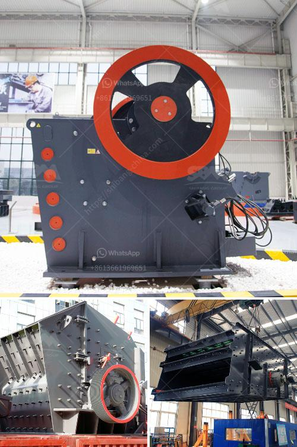

<h3>crusher machine for hardened powder</h3>
When it comes to processing hardened powder, having a reliable and efficient crusher machine is crucial. Whether you are involved in the pharmaceutical, chemical, or materials processing industries, the quality of the final product heavily relies on the equipment used. In this article, we will discuss the significance of using a crusher machine for hardened powder and how it enhances efficiency and productivity.

Firstly, what is hardened powder? Hardened powder refers to powder materials that have undergone a process of solidification or consolidation. It could be hardened due to pressure, temperature, or other manufacturing processes. Often, it becomes challenging to break down hardened powder through conventional methods such as grinding or milling. This is where a high-quality crusher machine can make a significant difference.

One of the key advantages of using a crusher machine for hardened powder is its ability to handle tough materials. The robust design and powerful mechanism of these machines can crush even the hardest powders with ease. This means that manufacturers can process their materials more efficiently, reducing production time and achieving higher productivity levels.

Additionally, using a crusher machine ensures uniformity in particle size distribution. Unlike traditional milling methods, where particles can vary in size, crushers provide precise and consistent results. By crushing hardened powder to a uniform size, manufacturers can achieve better blending and mixing of ingredients, resulting in higher-quality end products.

Another benefit of using a crusher machine for hardened powder is the reduction in energy consumption. These machines are designed to optimize the crushing process, minimizing energy usage while maximizing efficiency. By using less energy, manufacturers can significantly reduce operational costs, making their production processes more sustainable and economical.

Furthermore, crusher machines for hardened powder often come with additional features and customization options. For instance, some models offer adjustable speed control, allowing manufacturers to regulate the crushing process according to their specific requirements. This flexibility enables manufacturers to fine-tune the production process, ultimately leading to higher-quality products.

Safety is also a significant aspect of utilizing a crusher machine for hardened powder. Most modern machines are equipped with advanced safety features, including emergency stop buttons, safety shields, and automatic shut-off mechanisms. These safety measures ensure the protection of operators and minimize the risk of accidents or injuries during operation.

In conclusion, the use of a crusher machine for hardened powder is essential in various industries where solidified or consolidated powders need to be processed. Its capability to handle tough materials, achieve uniform particle size, reduce energy consumption, and offer customization options makes it a valuable asset for manufacturers. Moreover, the advanced safety features incorporated in these machines prioritize operator safety, ensuring a secure working environment.

Investing in a high-quality crusher machine for hardened powder can significantly enhance efficiency and productivity in manufacturing processes. As technology continues to advance, crusher machines are becoming more sophisticated, offering better performance, greater flexibility, and improved safety features. Manufacturers should consider these benefits and choose a crusher machine that aligns with their specific requirements to achieve optimal results in their production operations.
<h3>Contact us</h3><ul><li><strong>Whatsapp:&nbsp;<a href="https://wa.me/8613661969651">+8613661969651</a></strong></li><li><a href="https://swt.shibang-china.com/?git&amp;zhl&amp;crusher machine for hardened powder"><strong>Online Service(chat now)</strong></a></li></ul><h3>Related</h3><ul><li><a href='aggregates crashing plant in nigeria.md'>aggregates crashing plant in nigeria</a></li><li><a href='stone crushers gold.md'>stone crushers gold</a></li><li><a href='manufacturers of conveyor belts.md'>manufacturers of conveyor belts</a></li><li><a href='stone crusher plant price in india.md'>stone crusher plant price in india</a></li><li><a href='cement plant equipment catalogue pdf.md'>cement plant equipment catalogue pdf</a></li></ul>