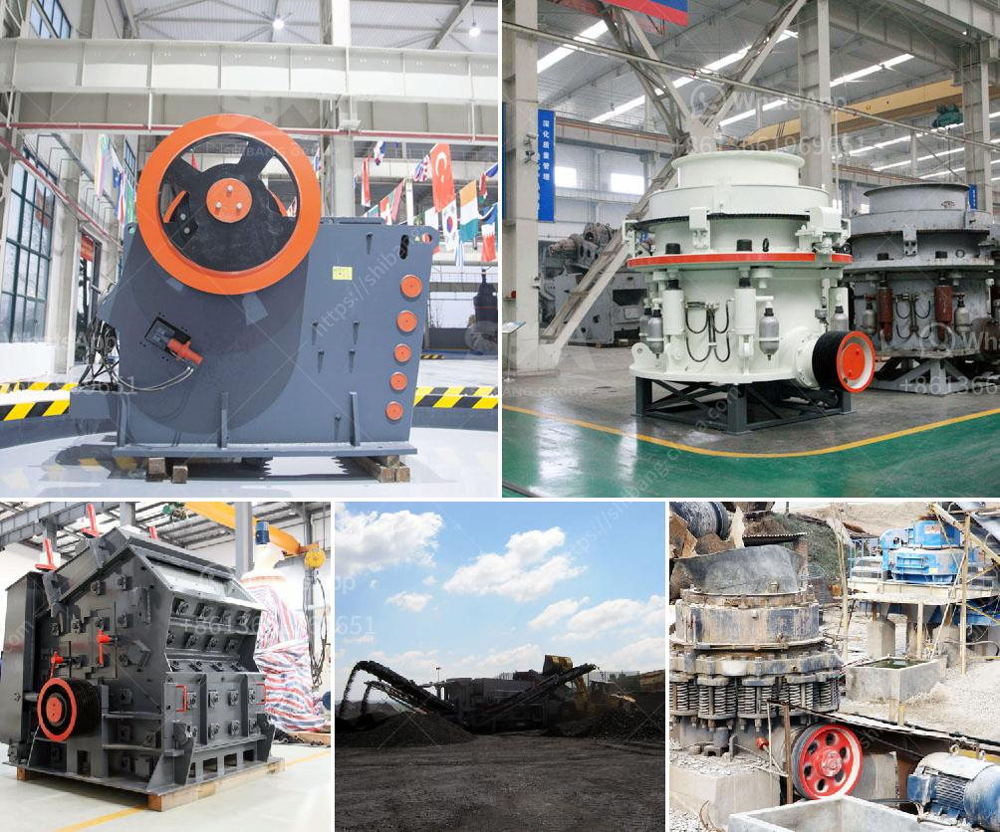

<h3>crusher machine for marble and granite</h3>
Crusher machines are ideal for processing marble and granite materials in many industries, such as construction, metallurgy, chemical industry, and mining. It can handle the material with the side length of 100-500mm and the compressive strength up to 350MPa.

When choosing the right crusher machine for your marble or granite crushing, there are several factors to consider, such as the property of the stone, the final product size, the capacity, working stability, energy consumption, and the overall cost. Furthermore, the crusher machine should be equipped with an iron removal device to prevent the iron parts from damaging the machine.

In terms of crushing effect, the crusher machine can process materials with large sizes into small particles. At the same time, it can also achieve the fine-crushing effect of materials with smaller sizes. The finished products are neat and the grain size is uniform. In addition, the crusher machine is flexible and can be switched between the coarse crushing machine, the medium crushing machine, and the fine crushing machine according to the actual needs.

The most outstanding advantage of the crusher machine is that it can handle materials with high moisture content. During the operation, it does not block materials and has little dust and low noise. Moreover, the equipment is equipped with advanced technology and excellent materials to make the machine more durable. It has a long service life and requires less maintenance, which reduces the investment and operating costs.

As for the performance of marble and granite, the common characteristics are high hardness and high compressive strength, which determine the crusher's selection and equipment combination. The main crushing equipment of the machine is a jaw crusher. It has strong crushing ability and is mainly used for the crushing of medium-hard materials, such as various ores and bulk materials. The wear-resistant parts of the equipment are made of high-quality steel, which extends the service life of the equipment and reduces maintenance costs.

In addition, other equipment such as cone crushers, impact crushers, and sand making machines can also be used in the production line of marble and granite. However, jaw crushers are used as the first choice and cone crushers are mainly used in the second and third crushing stages of the production line.

To sum up, crusher machines are essential equipment in construction, metallurgy, chemical industry, and mining industries for processing marble and granite materials. They have greater advantages in processing high-hardness materials and are more flexible in operation. Additionally, with the development of technology, crusher machines will become more efficient, energy-saving, and environmentally friendly.
<h3>Contact us</h3><ul><li><strong>Whatsapp:&nbsp;<a href="https://wa.me/8613661969651">+8613661969651</a></strong></li><li><a href="https://swt.shibang-china.com/?git&amp;zhl&amp;crusher machine for marble and granite"><strong>Online Service(chat now)</strong></a></li></ul><h3>Related</h3><ul><li><a href='silica sand crusher in ghana.md'>silica sand crusher in ghana</a></li><li><a href='price of concrete crushing machine for sale.md'>price of concrete crushing machine for sale</a></li><li><a href='stone crusher plant price in india.md'>stone crusher plant price in india</a></li><li><a href='delhi ball mill ceramic lining.md'>delhi ball mill ceramic lining</a></li><li><a href='sand gold crusher equipment made in canada.md'>sand gold crusher equipment made in canada</a></li></ul>