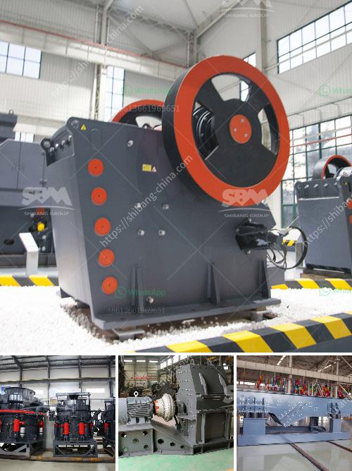

<h3>crusher machine in gujranwala location</h3>
Gujranwala, a flourishing industrial city in Punjab, Pakistan, has witnessed tremendous growth in its construction industry in recent years. With the increasing demand for infrastructure development and housing projects, there has been a surge in the requirement for high-quality construction materials. This is where crusher machines have become a boon for the construction industry in Gujranwala.

A crusher machine is a device that is designed to reduce large solid chunks of raw material into smaller chunks. It plays a crucial role in the preparation of raw material for construction purposes. These machines use brute force or pressure to break apart the desired material. They are capable of crushing a wide range of materials, including rocks, minerals, concrete, and asphalt.

One of the key benefits of using crusher machines in Gujranwala is their ability to produce high-quality aggregates that are essential for various construction purposes. These aggregates, such as crushed stones and sand, form the foundation of roads, buildings, and other infrastructure projects. The use of crusher machines ensures that only the required size of aggregates is produced, resulting in superior-quality construction materials.

Moreover, crusher machines in Gujranwala are designed to be highly efficient and cost-effective. They not only save time but also reduce the labor required for crushing materials manually. This, in turn, leads to increased productivity and cost savings for construction companies and contractors.

Another advantage of using crusher machines in Gujranwala is their contribution to environmental sustainability. These machines are designed with advanced technology to minimize dust and noise pollution during the crushing process. Additionally, the efficient use of raw materials through the crushing process minimizes waste production, making them environmentally friendly.

In conclusion, crusher machines have become an indispensable tool for the construction industry in Gujranwala. They offer numerous benefits, from producing high-quality aggregates required for construction projects to increasing efficiency and reducing environmental impact. With the continuous growth of the construction sector in Gujranwala, the demand for crusher machines is only expected to rise in the coming years.
<h3>Contact us</h3><ul><li><strong>Whatsapp:&nbsp;<a href="https://wa.me/8613661969651">+8613661969651</a></strong></li><li><a href="https://swt.shibang-china.com/?git&amp;zhl&amp;crusher machine in gujranwala location"><strong>Online Service(chat now)</strong></a></li></ul><h3>Related</h3><ul><li><a href='quote for vsi crusher.md'>quote for vsi crusher</a></li><li><a href='raymond mill for sale.md'>raymond mill for sale</a></li><li><a href='mobile stone crusher in.md'>mobile stone crusher in</a></li><li><a href='estimated cost of building a steel mill.md'>estimated cost of building a steel mill</a></li><li><a href='construction material recycling.md'>construction material recycling</a></li></ul>