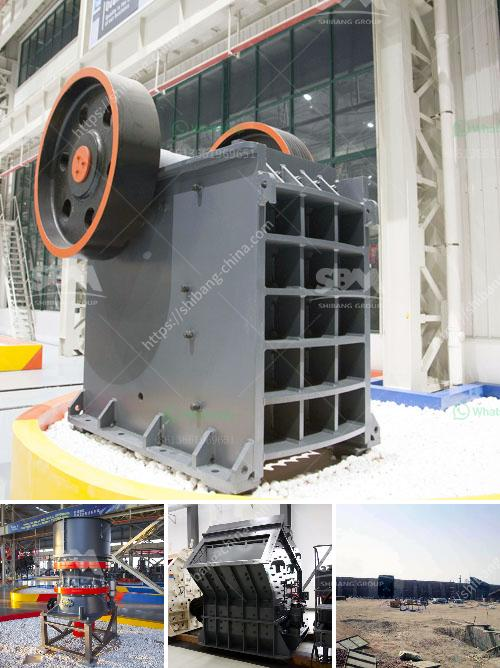

<h3>crusher machine made in england</h3>
Crusher machines have become the cornerstone of the mining and construction industries, as they provide essential crushing capabilities to process a wide range of materials. The crusher machine made in England is designed to crush different types of raw material efficiently and economically, whether it is granite, quartz, limestone, or other materials.

In the mining industry, jaw crushers are a popular alternative to traditional cone crushers and impact crushers, as they offer a higher reduction ratio and a more consistent product size. Additionally, they are capable of handling larger feed sizes, making them ideal for primary crushing applications.

The crusher machines made in England are renowned for their durability and reliability, ensuring they can withstand the harsh conditions often encountered in mining operations. These machines are engineered to be robust, with heavy-duty components and a sturdy frame that can withstand the rigorous demands of the industry.

Furthermore, crusher machines made in England are equipped with advanced features to optimize their performance and minimize downtime. Innovative technologies such as hydraulic systems, automatic adjustment settings, and overload protection ensure efficient operation and prevent damage to the machine.

Additionally, the crusher machines made in England are designed with ease of maintenance in mind. Accessible components, user-friendly interfaces, and quick-change mechanisms facilitate routine inspections, servicing, and repairs, reducing downtime and increasing productivity.

Furthermore, these machines are built to comply with strict safety regulations, providing a secure working environment for operators. Safety features such as emergency stop buttons, protective guards, and advanced monitoring systems ensure safety is prioritized during operation.

Investing in a crusher machine made in England provides businesses with a reliable and efficient solution for their crushing needs. With robust construction, advanced features, and easy maintenance, these machines enable mining and construction companies to process material efficiently, enhance productivity, and meet their project goals effectively.
<h3>Contact us</h3><ul><li><strong>Whatsapp:&nbsp;<a href="https://wa.me/8613661969651">+8613661969651</a></strong></li><li><a href="https://swt.shibang-china.com/?git&amp;zhl&amp;crusher machine made in england"><strong>Online Service(chat now)</strong></a></li></ul><h3>Related</h3><ul><li><a href='working scale model stone crusher.md'>working scale model stone crusher</a></li><li><a href='zimbabwe mobile crusher rentals.md'>zimbabwe mobile crusher rentals</a></li><li><a href='kaolin crusher manufacturers in uk.md'>kaolin crusher manufacturers in uk</a></li><li><a href='coal powder mill.md'>coal powder mill</a></li><li><a href='gypsum board manufacturing plant cost.md'>gypsum board manufacturing plant cost</a></li></ul>