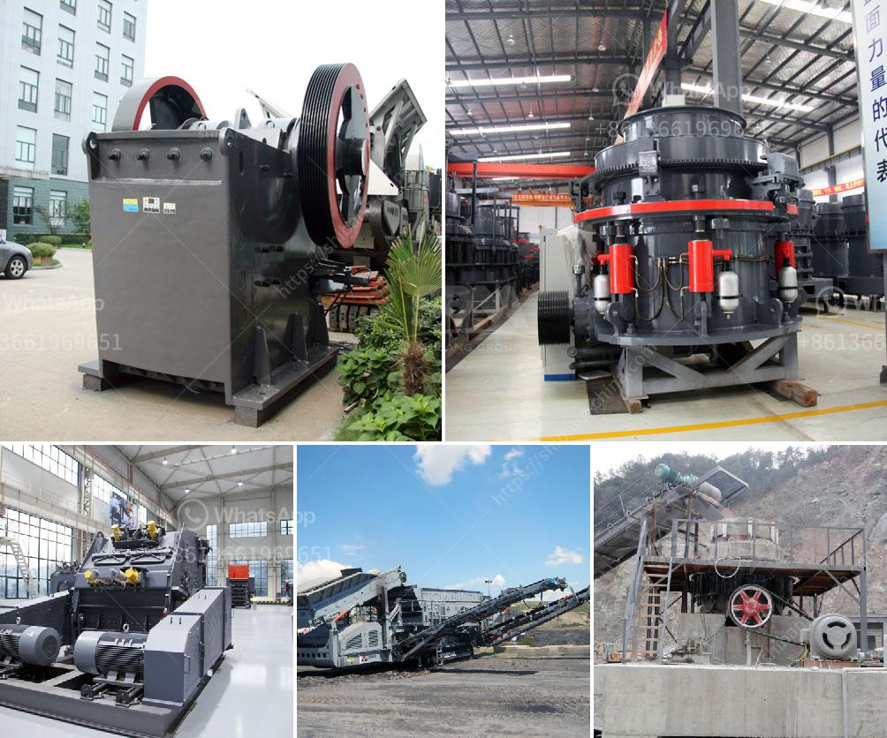

<h3>crusher machine plant estimation cost</h3>
The importance of investing in a good crusher machine plant cannot be overstated for any business. It not only increases productivity but also decreases overall operational costs. With this in mind, it is essential to make a well-informed decision when it comes to purchasing a crusher machine plant. One crucial factor to consider is the estimation of cost.

Estimating the cost of a crusher machine plant is not as simple as calculating the initial investment. There are many factors to consider, including the type and model of the machine, the manufacturer, and the scope of the project. However, despite these complexities, it is possible to make a rough estimate of the cost, which can help in budget planning and decision-making.

The first step in estimating the cost is to determine the type of crusher machine plant needed for the project. There are various types of crushers available, each serving a different purpose. For example, a jaw crusher is suitable for primary crushing, while a cone crusher is used for secondary or tertiary crushing. The choice of the crusher machine will depend on factors such as the material to be crushed, the desired output, and the budget.

Once the type of crusher machine plant is determined, the next step is to choose a reliable manufacturer. It is crucial to select a manufacturer with a good reputation and experience in the industry. A reputable manufacturer will not only provide a quality machine but also offer after-sales service and support. Additionally, they should be able to provide a warranty for the machine, which can further reduce potential costs in the long run.

After choosing the manufacturer, it is essential to assess the scope of the project. This includes factors such as the size of the plant, the required capacity, and the installation process. A larger plant with higher capacity will generally cost more than a smaller one. Similarly, if the installation process is complex and requires additional equipment or labor, it will add to the overall cost. Thus, it is crucial to have a clear understanding of the project requirements to estimate costs accurately.

Another aspect to consider is the operating costs of the crusher machine plant. This includes costs such as electricity, fuel, maintenance, and spare parts. It is essential to choose a machine that is energy-efficient and requires minimal maintenance. Additionally, opting for a machine from a manufacturer that offers readily available spare parts can reduce downtime and operational costs.

In conclusion, estimating the cost of a crusher machine plant is a complex process that requires careful consideration of various factors. However, by determining the type of machine, choosing a reputable manufacturer, assessing the project scope, and considering operating costs, it is possible to make a rough estimate. This estimation can help businesses plan their budgets, make informed decisions, and invest in a crusher machine plant that maximizes productivity while minimizing overall costs.
<h3>Contact us</h3><ul><li><strong>Whatsapp:&nbsp;<a href="https://wa.me/8613661969651">+8613661969651</a></strong></li><li><a href="https://swt.shibang-china.com/?git&amp;zhl&amp;crusher machine plant estimation cost"><strong>Online Service(chat now)</strong></a></li></ul><h3>Related</h3><ul><li><a href='ball mill supliers in south africa.md'>ball mill supliers in south africa</a></li><li><a href='small scale copper refining equipment.md'>small scale copper refining equipment</a></li><li><a href='limestone ore processing plant.md'>limestone ore processing plant</a></li><li><a href='limestone ball rod mill.md'>limestone ball rod mill</a></li><li><a href='chrome mining business plan.md'>chrome mining business plan</a></li></ul>