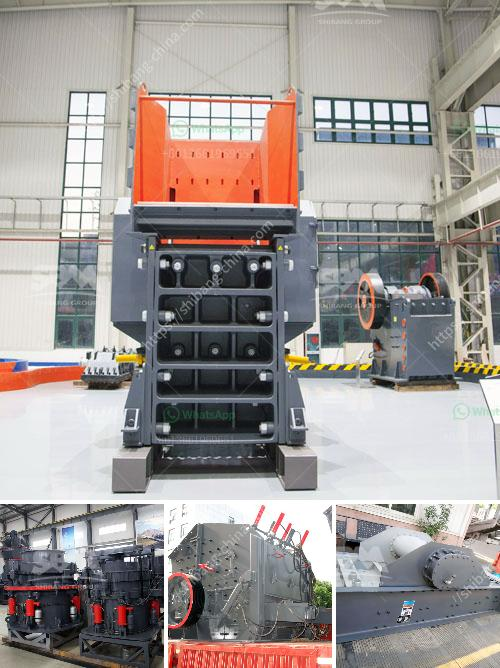

<h3>crusher machines made in saudi</h3>
Saudi Arabia, as we all know, is a land of opportunities. Aspiring entrepreneurs are always exploring new avenues to establish their dream businesses and contribute to the country's economic growth. In recent years, one industry that has witnessed significant advancements and attracted considerable capital investment is the mining industry. And at the forefront of this revolution are the crusher machines made in Saudi Arabia.

In the past, crushers were imported from different countries; however, the availability of locally made machines in Saudi has resulted in several advantages for the mining industry. Let's explore how these crusher machines have become a game-changer in this sector.

Firstly, the availability of crusher machines made in Saudi Arabia in itself is a major boost to the mining industry. These mech machines not only save costs but also ensure the timely availability of essential mining materials. Crusher machines made in Saudi Arabia have revolutionized the mining industry, making it more efficient and safe. They are highly reliable and require minimal maintenance, thanks to their robust construction and the latest technology used by manufacturers across the country.

One of the most crucial aspects of any crusher machine is its capacity to withstand extreme conditions. Saudi Arabia's harsh climate and abrasive substances require machines to be built with utmost durability. Manufacturers of crusher machines in Saudi Arabia have utilized cutting-edge engineering techniques to ensure each crusher boasts the necessary strength to withstand demanding applications. Saudi-made crusher machines are known for their sturdiness and reliability.

Furthermore, these crusher machines are made using locally available raw materials. Saudi Arabia is rich in natural resources, including limestone, sand, and granite. The production of crusher machines within the country not only reduces the dependence on imports but also creates job opportunities for the local workforce. This not only strengthens the economy but also fosters the growth of a skilled workforce, ensuring sustainable development in the long run.

Another significant advantage of crusher machines made in Saudi Arabia is their cost-effectiveness. Manufacturers strive to offer competitively priced machines without compromising on quality. This has brought down the overall cost of crushers, making them more affordable for small and medium-sized mining businesses. The reduced cost allows entrepreneurs to invest in better machinery, optimizing the entire mining process, and ultimately increasing the profitability of their operations.

Moreover, Saudi-made crusher machines adhere to international quality standards. The manufacturers are keen on adopting modern technologies and techniques that enhance the performance and efficiency of their products. These machines go through rigorous testing to ensure they meet the highest quality benchmarks and comply with safety regulations. The dedication to quality is evident in how Saudi-made crusher machines are highly regarded and trusted by industry professionals globally.

In conclusion, the advent of crusher machines made in Saudi Arabia has brought remarkable changes to the mining industry. These machines have not only reduced costs and enabled sustainable development but also enhanced efficiency and safety. They have helped create a competitive market, driving innovation and ensuring the mining industry's growth for years to come. The crusher machines made in Saudi Arabia are undoubtedly a game-changer in the mining industry, and one can expect further advancements and improvements in the years ahead.
<h3>Contact us</h3><ul><li><strong>Whatsapp:&nbsp;<a href="https://wa.me/8613661969651">+8613661969651</a></strong></li><li><a href="https://swt.shibang-china.com/?git&amp;zhl&amp;crusher machines made in saudi"><strong>Online Service(chat now)</strong></a></li></ul><h3>Related</h3><ul><li><a href='terrex stone crushers in usa.md'>terrex stone crushers in usa</a></li><li><a href='ball grinder machine.md'>ball grinder machine</a></li><li><a href='stone crushing process.md'>stone crushing process</a></li><li><a href='stone crushers from china.md'>stone crushers from china</a></li><li><a href='bauxite beneficiation plant.md'>bauxite beneficiation plant</a></li></ul>