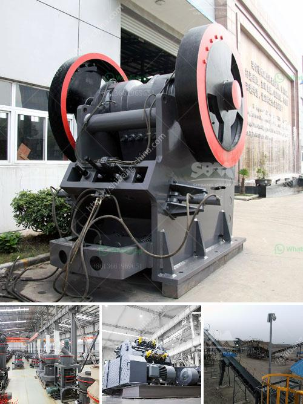

<h3>crusher manufacturer china</h3>
China is emerging as a global manufacturing hub, especially in the field of heavy machinery and equipment. One such industry that is gaining traction in the Chinese market is the crusher manufacturing industry. Crusher machines comprise a significant component in various industries such as mining, construction, and infrastructure. In recent years, the demand for crushers has increased significantly in China, further fueling the growth of crusher manufacturers in the country.

China is known for its robust manufacturing capabilities, offering a wide range of products at competitive prices. The crusher manufacturing industry in China has witnessed steady growth over the past few decades. The country has become a leading global supplier of crushers due to its ability to mass-produce these machines with high quality and efficiency.

Chinese crusher manufacturers have been focusing on technological advancements to improve their product offerings. Innovations in materials and design have enhanced the durability and lifespan of crushers, making them more cost-effective for customers. Additionally, these manufacturers are investing in research and development to offer advanced features such as automation, remote control, and improved safety systems.

One of the key advantages of purchasing crusher machines from Chinese manufacturers is the cost-effectiveness. China's low labor costs and efficient production capabilities allow them to produce crushers at relatively lower prices compared to their counterparts in other countries. This makes Chinese crushers an attractive option for businesses looking for affordable and reliable crushing solutions.

Moreover, Chinese manufacturers are known for their extensive distribution networks, making it easier for customers to access their products. They have established partnerships with local suppliers and distributors in various countries, enabling them to reach customers globally. This widespread distribution network ensures that customers can receive timely support and after-sales services.

Additionally, Chinese manufacturers are increasingly focusing on sustainability and environmental impact. Many crushers manufactured in China are designed with energy-saving features, reducing power consumption and minimizing environmental pollution. These eco-friendly crushers not only meet the requirements of local environmental regulations but also align with the global shift towards sustainable practices.

However, it is important to consider certain factors when purchasing crushers from Chinese manufacturers. Although the industry is largely regulated, it is crucial to conduct thorough research on the manufacturer's reputation, quality control procedures, and certifications. Customers should also inquire about warranty periods, after-sales services, and spare part availability to ensure a smooth and hassle-free experience.

In conclusion, China's crusher manufacturing industry is witnessing significant growth, driven by its advanced technology, cost-effectiveness, and extensive distribution networks. Chinese manufacturers are continuously investing in research and development to improve product quality, sustainability, and efficiency. With strict quality control procedures and a focus on customer satisfaction, Chinese crushers are becoming increasingly popular worldwide. However, customers should exercise due diligence and research before finalizing their purchase to ensure they select a reputable manufacturer that meets their specific needs.
<h3>Contact us</h3><ul><li><strong>Whatsapp:&nbsp;<a href="https://wa.me/8613661969651">+8613661969651</a></strong></li><li><a href="https://swt.shibang-china.com/?git&amp;zhl&amp;crusher manufacturer china"><strong>Online Service(chat now)</strong></a></li></ul><h3>Related</h3><ul><li><a href='processing of feldspar crushing.md'>processing of feldspar crushing</a></li><li><a href='bentonite powder plant in surat.md'>bentonite powder plant in surat</a></li><li><a href='machines used for mining gypsum.md'>machines used for mining gypsum</a></li><li><a href='belt conveyor indonesia.md'>belt conveyor indonesia</a></li><li><a href='general hypothesis of jaw crusher.md'>general hypothesis of jaw crusher</a></li></ul>