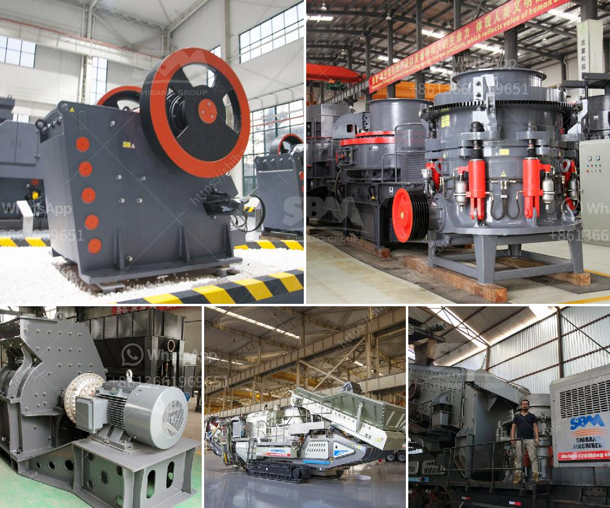

<h3>crusher manufacturer in gujarat</h3>
Crusher is a machine designed to reduce large rocks into smaller rocks, gravel, or rock dust. Crushers may be used to reduce the size, or change the form, of waste materials so they can be more easily disposed of or recycled, or to reduce the size of a solid mix of raw materials so that pieces of different composition can be differentiated. Crushing is the process of transferring a force amplified by mechanical advantage through a material made of molecules that bond together more strongly, and resist deformation more, than those in the material being crushed do.

Gujarat is one of the leading industrialized states in India which has vast resources in terms of limestone, lignite, bauxite, natural gas, and petroleum. With these resources, the state has transformed into an industrial hub, promoting growth and development. The crusher industry in Gujarat plays a significant role in the state's economy and contributes to its industrial growth.

There are several crusher manufacturers in Gujarat, producing a variety of crushing machines like jaw crushers, cone crushers, vertical shaft impactors, etc. These machines are known for their robust construction, durability, and high efficiency. Additionally, they are also equipped with advanced features like hydraulic systems, automation, and adjustable settings, making crushing easier and more efficient.

One prominent crusher manufacturer in Gujarat is Maxwell Crushtech. Established in the year 1989, Maxwell Crushtech has been manufacturing high-quality crushers and screens to cater to the diverse requirements of their customers. They have a state-of-the-art manufacturing facility in Gujarat, equipped with advanced machinery and technology.

Maxwell Crushtech offers a wide range of crushers, including jaw crushers, cone crushers, impact crushers, and vibrating screens. Their crushers are designed for various applications like mining, construction, and recycling. The company's primary focus is to deliver machines that are reliable, efficient, and capable of delivering consistent performance.

In addition to their robust construction and high-quality materials, Maxwell Crushtech crushers are known for their advanced features and user-friendly operation. Their jaw crushers, for example, are designed with a hydraulic system that allows easy adjustment of the closed side setting, ensuring precise and uniform particle size output. The cone crushers are equipped with a hydraulic system for easy and safe adjustment of the crusher setting during operation.

Apart from manufacturing crushers, Maxwell Crushtech also provides efficient after-sales service and support. They have a team of experienced engineers who are readily available to assist customers with any technical queries or issues they may face. This ensures that customers can rely on Maxwell Crushtech's expertise even after the purchase of their crusher.

In conclusion, the crusher manufacturing industry in Gujarat is thriving, contributing to the state's industrial growth. Maxwell Crushtech is one of the prominent crusher manufacturers in Gujarat, known for their high-quality and reliable crushers. Their range of crushers offers advanced features, durability, and efficient performance, making them a preferred choice for various applications. With their focus on customer satisfaction and after-sales service, Maxwell Crushtech continues to lead the crusher manufacturing industry in Gujarat.
<h3>Contact us</h3><ul><li><strong>Whatsapp:&nbsp;<a href="https://wa.me/8613661969651">+8613661969651</a></strong></li><li><a href="https://swt.shibang-china.com/?git&amp;zhl&amp;crusher manufacturer in gujarat"><strong>Online Service(chat now)</strong></a></li></ul><h3>Related</h3><ul><li><a href='bentonite processing plant in maharashtra.md'>bentonite processing plant in maharashtra</a></li><li><a href='tonnes per hour crusher.md'>tonnes per hour crusher</a></li><li><a href='nigeria stone crusher.md'>nigeria stone crusher</a></li><li><a href='white clay crusher process.md'>white clay crusher process</a></li><li><a href='gypsum powder production equipment price.md'>gypsum powder production equipment price</a></li></ul>