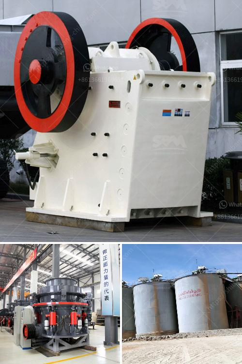

<h3>crusher manufacturers in ahmedabad</h3>
India has become the leading consumer of electronic products and automobiles, indicating rapid urbanization and industrialization. This has resulted in increased usage of machinery, including crushers, to meet the growing demands of various sectors. Crusher manufacturers in Ahmedabad are offering a wide range of crushing and pulverizing machines that are designed to cater to the diverse requirements of the industry.

Crushers are used for crushing big rocks into smaller sizes or rocks, gravel, or rock dust. They are also used for gravel processing and recycling building waste. Crushers are indispensable machines in the mining and quarrying industry. Different types of stone crushers have different models, names, and functions. Sometimes, they are named according to materials such as rock crushers, ore crushers, quarry crushers, granite crushers, concrete crushers, etc. Among those, jaw crusher is the most common, which can be divided into fixed jaw crushers and mobile jaw crushers depending on the way of installation.

Jaw crusher is a common equipment for crushing materials. It is often used as a primary crusher for mining and construction industries. The company provides different models of jaw crushers, including PE, PEW, and HJ series jaw crushers. These jaw crushers have different specifications and can be used in different industries. For example, small jaw crusher can be used for construction waste treatment, mineral processing, building materials, cement, chemicals, and other industries.

Crusher manufacturers in Ahmedabad are offering a wide range of crushing and pulverizing machines that are designed to cater to the diverse requirements of the industry. One of the prominent names in the crushing industry, Abhishek Enterprises, is a highly trusted and reliable brand. Abhishek Enterprises has been providing crushers, pulverizers, and material handling equipment to the market for over three decades. The company offers a comprehensive range of high-quality crushers and pulverizers including impact crushers, cone crushers, jaw crushers, mixing mills, blending machines, and other industrial machinery.

Another renowned crusher manufacturer in Ahmedabad, Shree Conmix Engineers Pvt. Ltd., provides jaw crushers, crushing plants, and screening equipment to clients worldwide. The company offers a complete range of primary jaw crushers, secondary jaw crushers, cone crushers, and impact crushers to cater to the needs of different industries. These crushers are known for their robust construction, easy maintenance, and efficient operation.

Furthermore, MAXWELL CRUSHTECH is a leading player in the crushing industry in India, manufacturing a wide range of jaw crushers, cone crushers, impact crushers, sand making machines, and screening equipment. MAXWELL CRUSHTECH offers efficient and reliable solutions for crushing and screening needs.

The availability of high-quality crushers manufactured in Ahmedabad has eased the process of crushing bulk materials, turning them into smaller and more manageable sizes. The crushers not only help in reducing the size of materials but also enhance the overall efficiency of work in several industries.

To conclude, crusher manufacturers in Ahmedabad are contributing towards the growth of the industrial sector in India. With the increased demand for crushers from various industries, the competition in this market is also intensifying. Manufacturers are constantly striving to enhance the quality, performance, and features of their products to stay ahead in the competition, providing a wide range of options to the consumers.
<h3>Contact us</h3><ul><li><strong>Whatsapp:&nbsp;<a href="https://wa.me/8613661969651">+8613661969651</a></strong></li><li><a href="https://swt.shibang-china.com/?git&amp;zhl&amp;crusher manufacturers in ahmedabad"><strong>Online Service(chat now)</strong></a></li></ul><h3>Related</h3><ul><li><a href='price for rock crusher.md'>price for rock crusher</a></li><li><a href='prices of hammer mill in zimbabwe.md'>prices of hammer mill in zimbabwe</a></li><li><a href='quarry equipment manufacturer asia.md'>quarry equipment manufacturer asia</a></li><li><a href='business plan for quarry.md'>business plan for quarry</a></li><li><a href='setting up a stone quarry crusher business.md'>setting up a stone quarry crusher business</a></li></ul>