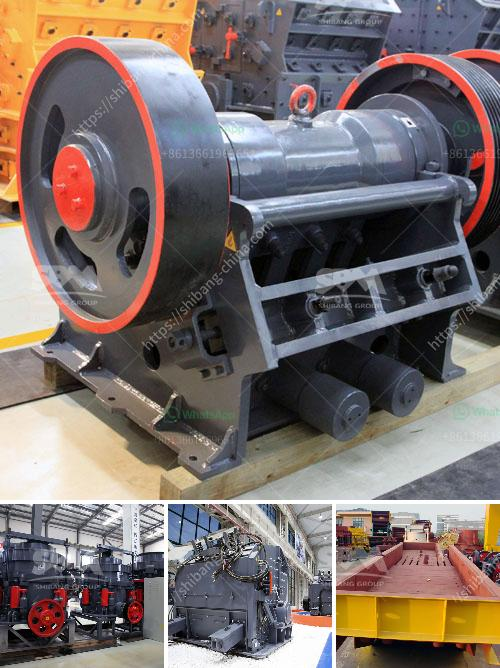

<h3>crusher manufacturers in india</h3>
India is one of the fastest-growing countries in terms of infrastructure development and urbanization. With the increasing demand for construction materials, such as crushed stones, sand, and gravel, the Indian crushing market is booming. Since crushers play a crucial role in the production of aggregates, selecting a suitable crusher for one's operations is critical. To meet the growing demand for high-quality machinery, manufacturers in India are developing cutting-edge crushers that offer safety, reliability, and efficiency.

One of the key players in the Indian crushing industry is Shree Conmix Engineers Pvt. Ltd. They are known for their supreme quality crushers in the market. The company has a team of experienced engineers who utilize their expertise to manufacture and supply a wide range of jaw crushers, cone crushers, vertical shaft impactors, and vibratory screens. These crushers are designed using advanced technology and innovative techniques to ensure reliable performance, low maintenance, and long service life.

Another leading crusher manufacturer, Torsa Machines Limited, strives to provide advanced technology-based crushing solutions to ease the process of crushing for aggregates and mining industries. With their headquarters located in Kolkata, the company offers a range of products, including jaw crushers, cone crushers, and impact crushers. Their product line also includes vibrating screens and portable crushing plants. Combining efficiency and innovation, Torsa Machines Limited aims to provide high-quality crushers that are energy-efficient and cost-effective.

The Laxmi Group, a leading manufacturer of stone crushing equipment in India, offers a range of jaw crushers under the brand name "Laxmi." These crushers offer robust construction, low maintenance, and high performance. They also combine compact design and user-friendly features to make crushing more comfortable and efficient. The Laxmi Group's crushers are widely used in both the mining and construction industries for crushing different types of materials.

One of the younger players in the Indian crushing market is Propel Industries. This Tamil Nadu-based company specializes in manufacturing state-of-the-art crushers that are used in various sectors, including mining, construction, and recycling. Propel offers a comprehensive range of jaw crushers, cone crushers, vertical shaft impactors, and screens. The company's crushers are known for their advanced technology, superior engineering, and excellent productivity.

Maxwell Crushtech is another renowned manufacturer of crushers in India. They offer a wide range of jaw crushers, cone crushers, and screens with varying specifications to meet the diverse needs of their clients. Maxwell Crushtech focuses on continuous research and development to deliver crushers that promote sustainability, reduce environmental impact, and improve overall efficiency.

India has a competitive crusher manufacturing industry, where manufacturers strive to produce innovative and technologically advanced crushers to meet the ever-increasing demands of the market. Whether it is a jaw crusher, cone crusher, or impact crusher, each type of crusher offers unique features and benefits that cater to specific applications. With a wide range of crusher manufacturers in India, customers can easily find the right crusher for their operations, ensuring efficiency, productivity, and profitability in their crushing processes.
<h3>Contact us</h3><ul><li><strong>Whatsapp:&nbsp;<a href="https://wa.me/8613661969651">+8613661969651</a></strong></li><li><a href="https://swt.shibang-china.com/?git&amp;zhl&amp;crusher manufacturers in india"><strong>Online Service(chat now)</strong></a></li></ul><h3>Related</h3><ul><li><a href='crusher plant for sale in saudi.md'>crusher plant for sale in saudi</a></li><li><a href='large jaw crusher for sale.md'>large jaw crusher for sale</a></li><li><a href='jaw crusher what price in china.md'>jaw crusher what price in china</a></li><li><a href='model ball mill.md'>model ball mill</a></li><li><a href='aggregate washing machine cost.md'>aggregate washing machine cost</a></li></ul>