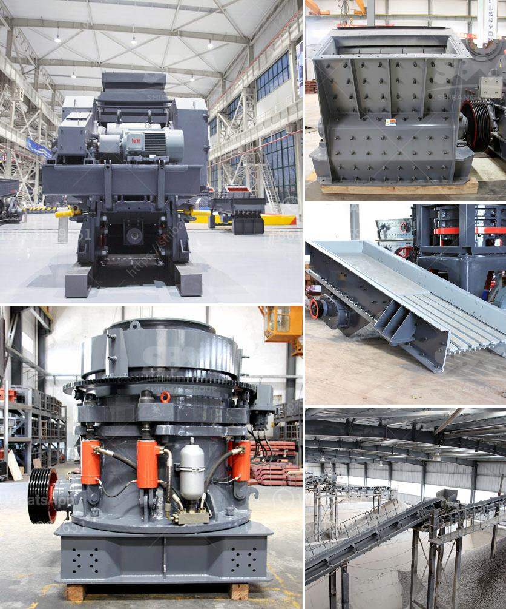

<h3>crusher manufacturers prices</h3>
When it comes to the manufacturing of crushers, getting the best quality product at an affordable price is crucial. Whether you are a contractor or a quarry owner, it is important to invest in reliable crushers that can efficiently break down materials and boost productivity. However, with numerous crusher manufacturers in the market, finding the right price can often be a challenging task.

The prices of crushers are influenced by several factors such as brand reputation, production capacity, and technical specifications. Established manufacturers with a strong market presence may have a higher price range due to their experience, product reliability, and customer support. On the other hand, newer manufacturers may offer competitive prices as they strive to establish their position in the industry.

When considering prices, it is crucial to compare the features and specifications offered by different manufacturers. Some crushers may come with advanced features like automation, adjustable settings, and energy-efficient motors. Such features can significantly enhance productivity and reduce overall operational costs. However, it is important to evaluate if these features are necessary for your specific requirements, as they can influence the price tag.

Additionally, production capacity plays a significant role in determining crusher prices. High-capacity crushers are capable of processing large volumes of materials, making them ideal for heavy-duty applications. However, they may come at a higher price due to their increased size and power requirements. If your operation requires a lower capacity, opting for a crusher with a smaller production capacity could be more cost-effective.

To find the best prices, it is essential to conduct thorough research and reach out to multiple manufacturers. Requesting quotes from different suppliers will allow you to compare prices and negotiate the best deal. Additionally, consulting industry experts and seeking recommendations from trusted sources can help you identify manufacturers known for their competitive prices and quality products.

In conclusion, finding the right crusher manufacturer with reasonable prices requires diligent research and evaluation. While prices can vary depending on factors such as brand reputation, technical specifications, and production capacity, it is crucial to prioritize your specific requirements and budget constraints. By considering these factors and exploring multiple options, you can make an informed decision and invest in a reliable crusher that offers great value for your money.
<h3>Contact us</h3><ul><li><strong>Whatsapp:&nbsp;<a href="https://wa.me/8613661969651">+8613661969651</a></strong></li><li><a href="https://swt.shibang-china.com/?git&amp;zhl&amp;crusher manufacturers prices"><strong>Online Service(chat now)</strong></a></li></ul><h3>Related</h3><ul><li><a href='used concrete crusher manufacturer in malaysia.md'>used concrete crusher manufacturer in malaysia</a></li><li><a href='buy a cement blending plant in south africa.md'>buy a cement blending plant in south africa</a></li><li><a href='raymond mill mumbai and kolkata.md'>raymond mill mumbai and kolkata</a></li><li><a href='rock stone zambia mining crushing plants.md'>rock stone zambia mining crushing plants</a></li><li><a href='ball coal crusher industries.md'>ball coal crusher industries</a></li></ul>