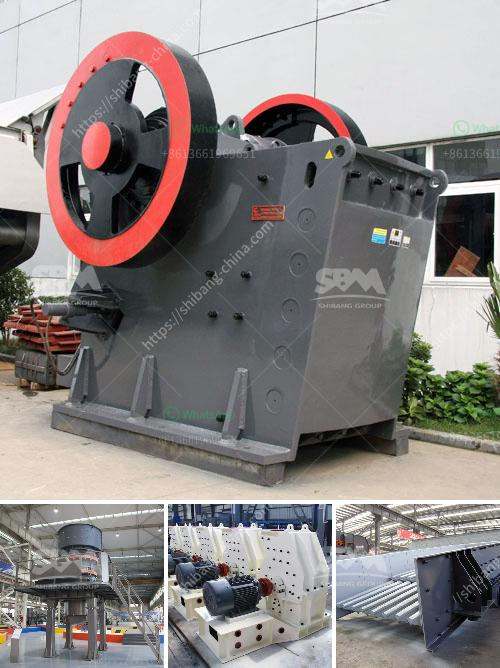

<h3>crusher manufacturers turkey</h3>
Crusher manufacturers in Turkey are primarily concerned with technological advancements and innovation efforts that are focused on improving machinery and equipment used in the crushing and screening processes. Backed by intensive research and development activities, crusher manufacturers have been able to produce quality machinery that is not only robust and durable but also highly efficient in extracting valuable minerals and aggregates.

Turkey, being a key player in the global mining industry, has been instrumental in supplying top-notch crushers for various applications. It is no surprise that the country has emerged as one of the world's leading crusher manufacturers. Crusher manufacturers in Turkey offer a wide range of top-notch crushing and screening machines that are designed to suit your needs. With their technological expertise and commitment to providing the best machinery, they ensure that their products are of premium quality, reliable, and deliver outstanding performance.

When it comes to crusher manufacturing, Turkey has established itself as a destination for impressive engineering capabilities. Turkish manufacturers have gone above and beyond to incorporate advanced features and technologies into their crushers, ensuring that they are equipped to handle even the most challenging materials. From heavy-duty jaw crushers to impact crushers, cone crushers, and VSI crushers, Turkish manufacturers offer a wide range of crushing solutions that cater to various industries and applications.

Moreover, crusher manufacturers in Turkey emphasize on the need for energy-efficient crushers that can reduce the environmental impact of the mining industry. As a result, they have developed crushers that promote sustainable practices, allowing for reduced energy consumption and lower carbon emissions.

Not only do Turkish crusher manufacturers offer high-quality and efficient machinery, but they also provide excellent after-sales services and support. This ensures that customers can rely on them to address any issues or concerns promptly, maximizing the productivity and longevity of their crushers.

In conclusion, Crusher manufacturers in Turkey have positioned themselves as leaders in the industry by consistently delivering high-quality, innovative, and reliable crushing and screening machinery. Their commitment to technological advancements, sustainable practices, and customer-focused solutions has made them a sought-after choice for customers across the globe. With Turkish manufacturers, you can rest assured that you are investing in top-notch machinery that will meet your crushing and screening demands, offering unmatched efficiency and reliability.
<h3>Contact us</h3><ul><li><strong>Whatsapp:&nbsp;<a href="https://wa.me/8613661969651">+8613661969651</a></strong></li><li><a href="https://swt.shibang-china.com/?git&amp;zhl&amp;crusher manufacturers turkey"><strong>Online Service(chat now)</strong></a></li></ul><h3>Related</h3><ul><li><a href='limestone beneficiation.md'>limestone beneficiation</a></li><li><a href='mobile crusher machine supplier.md'>mobile crusher machine supplier</a></li><li><a href='how does it hammer mill operats.md'>how does it hammer mill operats</a></li><li><a href='hammer mill for sale in zimbabwe.md'>hammer mill for sale in zimbabwe</a></li><li><a href='limestone ball rod mill.md'>limestone ball rod mill</a></li></ul>