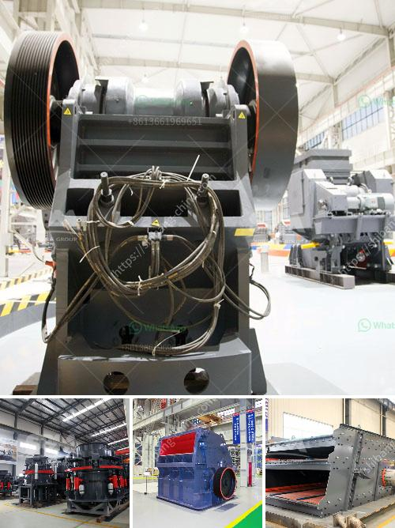

<h3>crusher material for stone crusher</h3>
When it comes to constructing buildings, roads, and railways, the importance of good-quality aggregate cannot be underestimated. After all, aggregate is the basic component used for producing concrete and asphalt, and it is also widely used for building foundations, drainage systems, and other infrastructure projects. To achieve these construction projects effectively, a stone crusher plays a crucial role in the process. In this article, we will explore the different types of materials that can be used for the crusher, and their advantages and disadvantages.

First and foremost, let's understand the purpose of a stone crusher. A stone crusher is a machine that reduces the size of large rocks into smaller rocks, gravel, sand, or rock dust. It utilizes a heavy-duty rotor to pulverize the material, allowing it to be easily disposed of or recycled for further use in construction.

One of the key components of a stone crusher is the crushing chamber. The crushing chamber is made up of two jaws, one fixed and the other moving, to simulate the movement of an animal's jaws. The materials to be crushed are fed into the chamber, which gradually reduces the size of the rocks until they pass through the narrow gap between the two jaws.

When choosing the right material for a stone crusher, the properties of the material, such as wear resistance, strength, and workability, are of utmost importance. Different stone crushers require different materials, for example, there are cone crushers, impact crushers, jaw crushers, and grinding mills. These different types of crushers require different materials, such as the following:

1. Hardness: The hardness of the material determines the type and depth of the crushing chamber. For hard and brittle materials, such as granite and basalt, a high-chromium cast iron plate is typically used. This material provides excellent wear resistance and is capable of withstanding high impact forces.

2. Strength: The strength of the material affects the overall durability and lifespan of the crusher. For materials with lower strength, such as limestone or sandstone, a carbon steel plate is commonly used. This material provides good strength and toughness, making it suitable for crushing softer rocks.

3. Abrasion resistance: For materials that are highly abrasive, such as quartz or gravel, special wear-resistant plates made of manganese or alloy steel are used. These plates can withstand extreme wear and tear, extending the lifespan of the crusher.

4. Workability: The workability of the material determines how easily it can be shaped and molded into the desired form. For materials that are difficult to process, such as ores or slags, special alloy steel plates or composite materials are used. These materials offer superior workability and are resistant to deformation during the crushing process.

In conclusion, the choice of crusher material for a stone crusher depends on the properties of the stone to be crushed. The hardness, strength, abrasion resistance, and workability of the material are important factors to consider. Additionally, the type of crusher also plays a significant role in selecting the right material. Ultimately, selecting the appropriate material will ensure the durability, efficiency, and effectiveness of the stone crusher and the construction projects it is involved in.
<h3>Contact us</h3><ul><li><strong>Whatsapp:&nbsp;<a href="https://wa.me/8613661969651">+8613661969651</a></strong></li><li><a href="https://swt.shibang-china.com/?git&amp;zhl&amp;crusher material for stone crusher"><strong>Online Service(chat now)</strong></a></li></ul><h3>Related</h3><ul><li><a href='hammer mill stone crusher.md'>hammer mill stone crusher</a></li><li><a href='coal washing plant suppliers.md'>coal washing plant suppliers</a></li><li><a href='coal crusher supplier.md'>coal crusher supplier</a></li><li><a href='prices of small gold processing machine.md'>prices of small gold processing machine</a></li><li><a href='trommel ball mill.md'>trommel ball mill</a></li></ul>