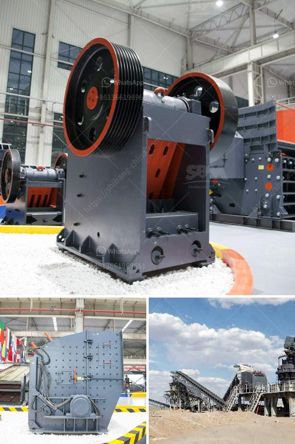

<h3>crusher material for stone</h3>
In the construction industry, crushing plants are a vital component. Stone crushers are used for crushing stones into specific sizes suitable for construction. Crusher material, also known as stone crushers, plays a crucial role in the stone crushing process. They reduce the size of large rocks and stones to smaller ones, enabling easier handling, efficient construction processes, and improved productivity. This article delves into the importance of crusher material in stone crushing, highlighting its various types, uses, and benefits.

One of the primary reasons crusher material is fundamental in stone crushing operations is its ability to break down large rocks into smaller, manageable sizes. Initially, in raw form, stones and rocks are often oversized and unfit for direct use in construction projects. That's where crushers come into play. They efficiently crush these large rocks into smaller, uniform sizes, ensuring they can be conveniently handled and transported to construction sites.

Several types of crusher materials are commonly used in the industry. One of the most popular choices is the jaw crusher. With simple construction and reliable operation, jaw crushers are widely used in various industries due to their versatility. They are designed to crush materials of different hardness levels, making them suitable to handle a wide range of stone types. Another commonly used crusher material is the cone crusher, which excels in secondary and tertiary crushing applications. Cone crushers are capable of producing finely crushed stones, delivering superior end products for different construction needs.

Crusher material also plays a significant role in determining the quality of the final product. By utilizing crushers, construction companies can produce crushed stones with specific grading and particle sizes. These controlled characteristics are crucial, as different construction projects require stones with specific properties and sizes to meet design specifications. Employing crusher material ensures that the final product satisfies these requirements, guaranteeing the durability and sturdiness of the constructed structure.

Beyond size reduction, crusher materials offer various benefits in stone crushing processes. For instance, they enhance efficiency by enabling the recycling of materials. Crushed stones can be reused in other construction projects, reducing waste and conserving natural resources. Additionally, crusher material promotes sustainability by reducing the need for new stone extraction, resulting in a smaller environmental impact. Employing crusher material is, therefore, a highly economical and eco-friendly practice in the stone crushing industry.

In conclusion, crusher materials are vital components in the stone crushing process. They effectively break down large rocks and stones into smaller, more manageable sizes, enabling convenient handling, transportation, and efficient construction processes. Jaw crushers and cone crushers are commonly used crusher materials due to their reliable operation and versatility. Furthermore, crusher materials ensure the production of uniformly sized stones, matching specific construction needs and enhancing the quality of the final product. Lastly, employing crusher material supports sustainability by facilitating recycling and reducing the environmental impact of extraction. Hence, it is clear that crusher materials are key players that contribute significantly to the success of the stone crushing industry.
<h3>Contact us</h3><ul><li><strong>Whatsapp:&nbsp;<a href="https://wa.me/8613661969651">+8613661969651</a></strong></li><li><a href="https://swt.shibang-china.com/?git&amp;zhl&amp;crusher material for stone"><strong>Online Service(chat now)</strong></a></li></ul><h3>Related</h3><ul><li><a href='quarry crushing equipments manufacturers.md'>quarry crushing equipments manufacturers</a></li><li><a href='stone crusher equipment manufacturer.md'>stone crusher equipment manufacturer</a></li><li><a href='price of stone crusher machine.md'>price of stone crusher machine</a></li><li><a href='mining conveyors for sale in zimbabwe.md'>mining conveyors for sale in zimbabwe</a></li><li><a href='crusher manufacturers turkey.md'>crusher manufacturers turkey</a></li></ul>