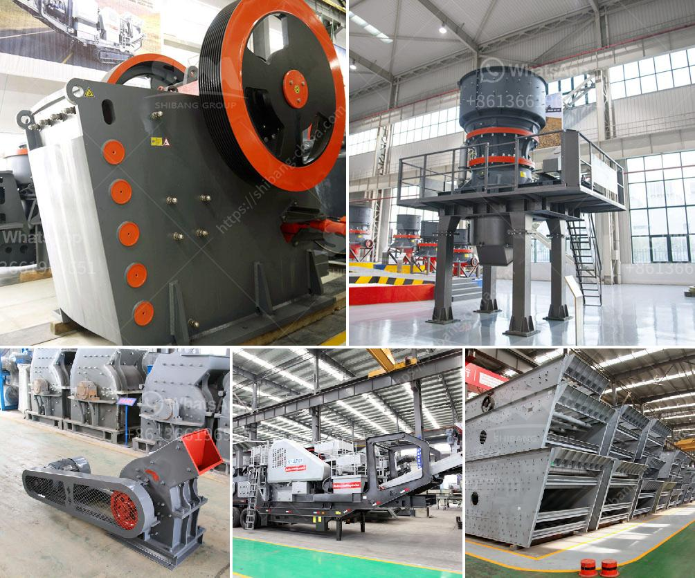

<h3>crusher plant cost estimation</h3>
Crushing is an integral part of any industrial process. Hence, to successfully set up a crusher plant, many factors need to be considered. What needs to be understood is that, plant setup cost comes in two parts:

The expenses associated with these categories fluctuate and are subject to market volatility. It is, therefore, essential to conduct an accurate cost estimation in order to make informed decisions when purchasing and operating a crusher plant.

The first major cost component of a crushing plant is personnel, which predominantly includes maintenance and fuel costs, along with their salaries. Typically, this category represents around 15-25% of the overall project cost. The logistics aspect, on the other hand, deals with the transportation of the plant's components and machinery to the desired site.

Keeping these factors in mind, it is crucial to analyze the location and accessibility of the site. If the site is far from suppliers, both personnel and logistics costs will increase significantly. Additionally, site accessibility is essential for routine maintenance and repairs. An easily accessible site will minimize downtime and enhance operational efficiency.

The second major cost factor in setting up a crusher plant is raw materials. These include aggregates, minerals, and ores - all of which vary in terms of availability, quality, and cost.

The location also plays a critical role in the procurement of raw materials. If the plant is situated near a quarry or mining site, the transportation cost of raw materials will be minimal. However, if the plant is situated far from the source, additional transportation costs will be incurred.

Furthermore, considering the quality of materials is vital. High-quality raw materials tend to be more expensive, but they lead to higher production efficiency and product quality. Balancing cost and quality is a challenge that operators must navigate to maximize profitability.

When estimating the cost of a crusher plant, it is crucial to evaluate the potential return on investment (ROI) and payback period. This requires obtaining accurate market data, analyzing trends, and forecasting demand. Additionally, it is essential to consider the local regulations and policies that may impact the project's financial viability.

Moreover, understanding the competitive landscape is crucial. Evaluating both direct and indirect competitors will enable potential investors to make better-informed decisions and select the most cost-effective solutions available.

Investing in a crusher plant is a significant decision for any business, and cost estimation is crucial to ensure profitability. By considering the personnel and logistics costs, raw material procurement, and economic considerations, operators can make informed decisions that will lead to success in the long run.

To accurately estimate the cost of setting up a crusher plant, it is advisable to consult with industry experts and specialists who can provide valuable insights and analysis. This will help businesses make informed decisions, avoid unnecessary expenses, and maximize returns on investment.
<h3>Contact us</h3><ul><li><strong>Whatsapp:&nbsp;<a href="https://wa.me/8613661969651">+8613661969651</a></strong></li><li><a href="https://swt.shibang-china.com/?git&amp;zhl&amp;crusher plant cost estimation"><strong>Online Service(chat now)</strong></a></li></ul><h3>Related</h3><ul><li><a href='how much is the price of a jaw crusher.md'>how much is the price of a jaw crusher</a></li><li><a href='roller mill type p500.md'>roller mill type p500</a></li><li><a href='biaya conveyor belt per meter instalasi.md'>biaya conveyor belt per meter instalasi</a></li><li><a href='business plan on how to start a small scale quarry plant.md'>business plan on how to start a small scale quarry plant</a></li><li><a href='slag crusher for sale.md'>slag crusher for sale</a></li></ul>