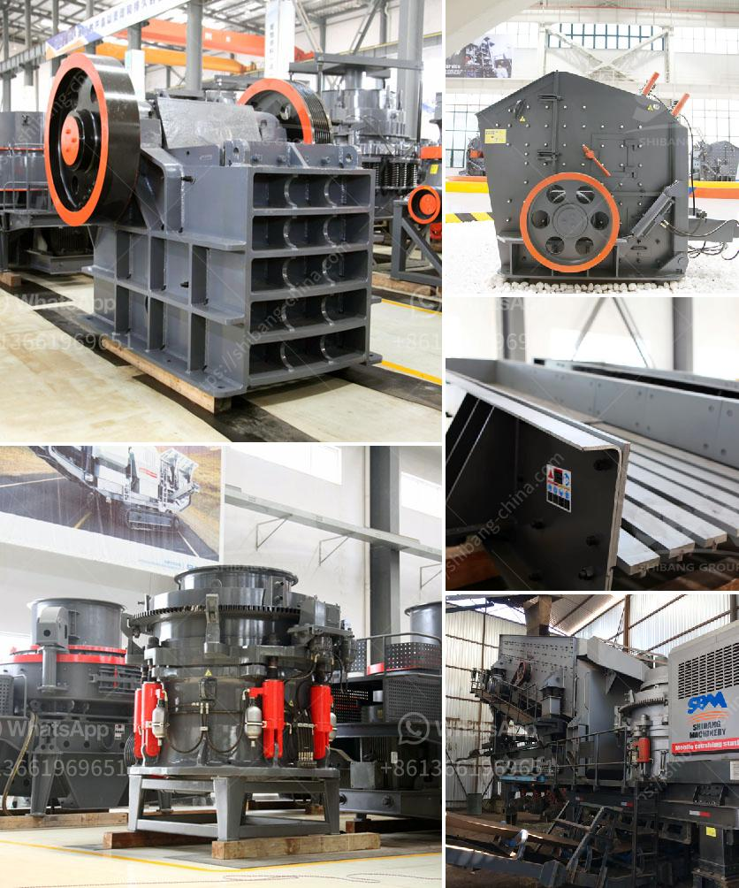

<h3>crusher plant cost in pakistan</h3>
In recent years, the Pakistani government has embarked on various infrastructure projects, such as the construction of roads, bridges, and buildings, to accommodate the rising needs of its growing population. This surge in infrastructure development has increased the demand for construction materials, particularly stone aggregates, hence creating a need for reliable and efficient crusher plants.

A crusher plant plays a crucial role in the uninterrupted and smooth production of these materials. These plants crush the extracted stones and transform them into smaller pieces, making them suitable for use in various construction projects. However, setting up and maintaining a crusher plant comes with its own costs and challenges, which need to be carefully assessed by the investors.

One of the most significant expenses in establishing a crusher plant is the cost of acquiring the necessary equipment. This includes excavators, loaders, dump trucks, and various types of crushers. Typically, a crusher plant in Pakistan costs around Rs. 50 million to Rs. 100 million. However, the actual cost may vary significantly depending on the size, capacity, and functionality of the plant.

Another important factor contributing to the crusher plant cost is the availability and accessibility of raw materials. The plant should ideally be located near a quarry or a site where stones are readily available. This helps reduce transportation costs and ensures a continuous supply of raw material to keep the plant running efficiently. Moreover, the cost of acquiring the necessary licenses and permits from the local authorities should also be taken into account.

Furthermore, running and maintaining a crusher plant involves various recurring expenses. These include the cost of employing skilled labor to operate the plant, regular maintenance and repairs, as well as the cost of electricity and fuel required for its operation. It is crucial to have a well-structured maintenance and repair plan to minimize downtime and ensure a longer lifespan for the plant, thus reducing overall operational costs.

Apart from the costs involved, it is essential to evaluate the financial viability of a crusher plant. The profitability of the plant depends on several factors, such as the demand for stone aggregates in the local market, competition from other suppliers, and the selling price of the final product. Conducting a thorough market analysis and feasibility study before investing in a crusher plant can help assess the potential risks and returns, enabling investors to make informed decisions.

In conclusion, crusher plants play a vital role in meeting the increasing demand for construction materials in Pakistan. However, setting up and operating a crusher plant entails significant costs, including the acquisition of equipment, availability of raw materials, and ongoing expenses related to maintenance and repairs. Conducting a comprehensive analysis of these costs and assessing the market demand is essential for investors to determine the economic feasibility of establishing a crusher plant. With careful planning and sound management, a crusher plant can provide a solid foundation for successful infrastructure projects in Pakistan.
<h3>Contact us</h3><ul><li><strong>Whatsapp:&nbsp;<a href="https://wa.me/8613661969651">+8613661969651</a></strong></li><li><a href="https://swt.shibang-china.com/?git&amp;zhl&amp;crusher plant cost in pakistan"><strong>Online Service(chat now)</strong></a></li></ul><h3>Related</h3><ul><li><a href='barite beneficiation.md'>barite beneficiation</a></li><li><a href='lime stone grinder machine price in india.md'>lime stone grinder machine price in india</a></li><li><a href='equipment mining grinding equipment for mezcal price.md'>equipment mining grinding equipment for mezcal price</a></li><li><a href='limestone impact crusher.md'>limestone impact crusher</a></li><li><a href='manufacturer of ball mill companies indonesia.md'>manufacturer of ball mill companies indonesia</a></li></ul>