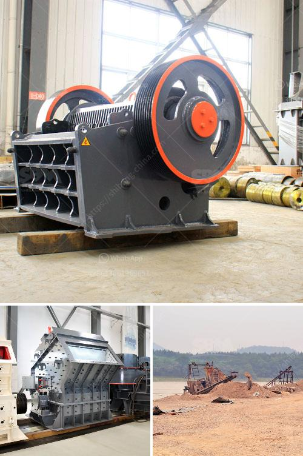

<h3>crusher plant for sale in saudi</h3>
As a professional crusher plant manufacturer, we can offer mobile and stationary crusher plant which are truly of world standard. We are leading and professional crusher manufacturer in the world. We supply all kinds of crushing equipments, and we offer it at a reasonable price, with warranty, installation and commissioning.

We have been in this industry for over 20 years, and have gained an excellent reputation amongst our customers, not only for the quality of our machines, but also for the systematic after-sales support and service that we provide. We have established a strong presence in Saudi Arabia through our local dealer network, with our products available throughout the country.

Saudi Arabia is famous for its vast deserts, stunning coastlines, and rich cultural heritage. With rapid economic growth and urbanization, Saudi Arabia has witnessed a surge in construction projects in recent years. These construction projects require large quantities of aggregate and various types of stones for the construction of roads, buildings, and other infrastructure.

Crusher plants are necessary for the construction of essential infrastructure, such as roads, bridges, buildings, and even railways. These plants enable the efficient crushing of rocks into granules or gravel, which is then used in further construction activities. These crusher plants are easy to install and are also available in various specifications to suit the specific requirements of different construction projects.

The crusher plant for sale in Saudi Arabia includes jaw crusher, cone crusher, impact crusher, VSI crusher, vibrating screen, belt conveyor and centrally electric control system. The crushing plant also incorporates several units such as feeding hopper, VSI sand crusher machine, vibrating screen, and conveyor. Our offered crushing plants can be fixed or mobile easily to fulfill the various requirements of clients. The mobile jaw crusher plant rental is very cheap and economic for small scale crushing project.

Selling a crusher plant is not an easy task, especially when you need to consider numerous parameters like operational costs, working conditions, competitive landscape, etc. We at AIMIX GROUP, have extensive experience in stone crushing industry, since 1992.

AIMIX possesses advanced technical supports, and engineers available to service machinery overseas. We can offer you free technical support and suggestions during the whole life of your investment. We are committed to providing professional services and high-quality products. We will help you maximize your project value because we have: 

1. A professional technical team working for you, with over 35 R&D engineers to support technical support throughout the plant’s life cycle.

If you are looking for a crusher plant for sale in Saudi Arabia, please don't hesitate to contact us. We look forward to serving you and helping you achieve success in your construction projects. With our world-class products and excellent after-sales service, we are confident that we can fulfill all your crusher plant requirements.
<h3>Contact us</h3><ul><li><strong>Whatsapp:&nbsp;<a href="https://wa.me/8613661969651">+8613661969651</a></strong></li><li><a href="https://swt.shibang-china.com/?git&amp;zhl&amp;crusher plant for sale in saudi"><strong>Online Service(chat now)</strong></a></li></ul><h3>Related</h3><ul><li><a href='used hammer mill for sale.md'>used hammer mill for sale</a></li><li><a href='jaw crusher price suppliers.md'>jaw crusher price suppliers</a></li><li><a href='tons hour gold wash plant.md'>tons hour gold wash plant</a></li><li><a href='feeders for hammer mills.md'>feeders for hammer mills</a></li><li><a href='feldspar ball mills manufacturers.md'>feldspar ball mills manufacturers</a></li></ul>