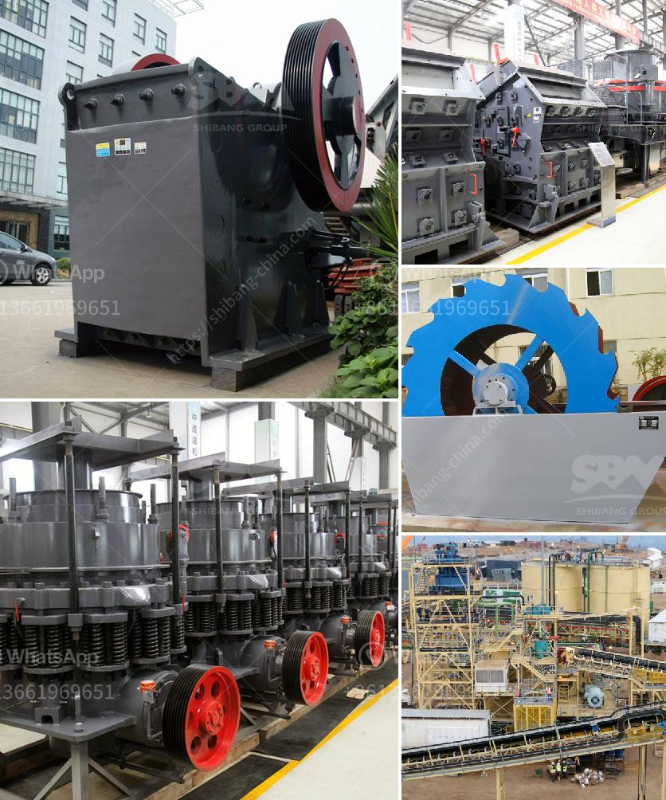

<h3>crusher plant for sale in south africa</h3>
Crusher plant for sale in South Africa is a key equipment in the mining industry. Now, let's introduce the Crusher plant for sale South Africa coordinates. It is a landlocked country in the southern part of the African continent. South Africa is bordered by Namibia, Botswana, Zimbabwe, Mozambique, Swaziland, and Lesotho. It is famous for its diverse culture, stunning landscape, and wildlife.

South Africa is also known for its mining activities. It is a global leader in the production of minerals like gold, diamond, coal, platinum, and manganese, among many others. Each of these minerals has its own presence in South Africa. Here are some of the minerals on the list with their respective mining sites:

With such a rich mining heritage, it is no surprise that there is a wide range of mining equipment available for sale, including the crusher plant. This is a crucial piece of machinery in the mining industry. These machines are used to break large rocks into smaller, more manageable sizes.

Crusher plants are designed to process rocks with a maximum size of 400mm into a smaller size, usually between 10-30mm. Crushing plants can be stationary or mobile, depending on the requirements of the mine.

Mobile crusher plants are the preferred choice for urban mining and crushing operations. They follow a continuous feed system, which means that they can process materials in batches, instead of individual pieces. This reduces transportation costs and allows for greater flexibility in terms of location.

There are various types of crusher plants for sale in South Africa. Some of them are stationary, while others can be mobile or portable. The choice depends on the needs of the mine and the preferences of the owner. Mobile crushers are popular in the mining industry, where they are used to process ores and minerals.

This machine is used in various mines and quarries to crush and convert rocks into fine sands. They come in a variety of sizes and can be operated in a stationary or mobile configuration.

This type of plant holds a cone-shaped head that moves continuously, crushing rocks between the head and the stationary surface. They are often used as secondary crushers.

These machines are designed to crush rocks that are soft, medium-hard, and abrasive. They can handle materials like rocks, ores, minerals, coal, and construction waste.

This equipment is used to sort and separate materials into different sizes. It is commonly used in mines, quarries, and construction sites.

In conclusion, crusher plants are essential pieces of equipment in the mining industry. These machines are used to break rocks into smaller sizes, making them more manageable and easier to transport. There are various types of crusher plants available for sale in South Africa, including mobile and stationary ones. The choice depends on the needs of the mine and the preferences of the owner. So, whether you are a miner or a contractor, consider investing in a crusher plant for your mining operations in South Africa.
<h3>Contact us</h3><ul><li><strong>Whatsapp:&nbsp;<a href="https://wa.me/8613661969651">+8613661969651</a></strong></li><li><a href="https://swt.shibang-china.com/?git&amp;zhl&amp;crusher plant for sale in south africa"><strong>Online Service(chat now)</strong></a></li></ul><h3>Related</h3><ul><li><a href='quick lime powder making machine.md'>quick lime powder making machine</a></li><li><a href='granite mining business model.md'>granite mining business model</a></li><li><a href='used stone crushers dealer.md'>used stone crushers dealer</a></li><li><a href='cost estimation for ball mills.md'>cost estimation for ball mills</a></li><li><a href='iron ore processing machine cost.md'>iron ore processing machine cost</a></li></ul>