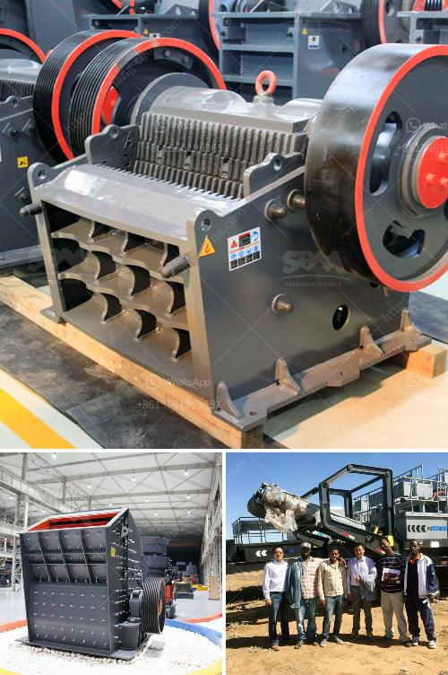

<h3>crusher plant manufacturer from italy</h3>
Italy, a country renowned for its rich culture and heritage, is home to many leading companies in various industries. One such industry is the manufacturing of crusher plants. Known for their excellent craftsmanship and durability, Italian crusher plants have gained worldwide recognition.

Italian crusher plant manufacturers have a strong presence not only in Italy but also across the globe. Their products are highly sought after due to their high-quality standards and innovative designs. These manufacturers understand the importance of delivering reliable machinery that can withstand the toughest conditions.

One of the leading crusher plant manufacturers from Italy is CRIFI Crushing Plant. Founded in 1981, CRIFI has been operating for over 30 years in the global market, offering a wide range of solutions for crushing, screening, and washing aggregates, concrete, asphalt, and more. Their products are designed to meet the specific requirements of each customer, ensuring maximum efficiency and productivity.

CRIFI Crushing Plant's product range includes jaw crushers, impact crushers, cone crushers, vibrating screens, washing systems, and belt conveyors. With their state-of-the-art technology and innovative approach, they have developed advanced solutions for the mining, quarrying, construction, and recycling industries.

Apart from CRIFI Crushing Plant, there are several other Italian manufacturers that are making a significant impact in the crusher plant industry. These companies include Baioni Crushing Plants, FIMSA, Frantoparts, Officine Conterno, and Rev Srl. Each of these manufacturers brings its unique expertise and specialization to cater to the diverse needs of their customers.

Italian crusher plants are known for their precision engineering, attention to detail, and commitment to customer satisfaction. They invest in research and development to continuously improve their products and stay ahead of the competition. With a focus on sustainability, these manufacturers also prioritize eco-friendly solutions and energy efficiency.

In conclusion, crusher plant manufacturers from Italy are at the forefront of the industry, providing reliable and efficient solutions for various crushing and screening needs. Whether it is for mining, quarrying, construction, or recycling, Italian manufacturers offer cutting-edge technology and exceptional quality. With their extensive experience and expertise, they continue to contribute to the growth and development of the global crusher plant industry.
<h3>Contact us</h3><ul><li><strong>Whatsapp:&nbsp;<a href="https://wa.me/8613661969651">+8613661969651</a></strong></li><li><a href="https://swt.shibang-china.com/?git&amp;zhl&amp;crusher plant manufacturer from italy"><strong>Online Service(chat now)</strong></a></li></ul><h3>Related</h3><ul><li><a href='four roller mill.md'>four roller mill</a></li><li><a href='coal size used for mills.md'>coal size used for mills</a></li><li><a href='new small gold processing equipment for sale in usa.md'>new small gold processing equipment for sale in usa</a></li><li><a href='coal mill manufacturers.md'>coal mill manufacturers</a></li><li><a href='calcium carbonate mill equipment.md'>calcium carbonate mill equipment</a></li></ul>