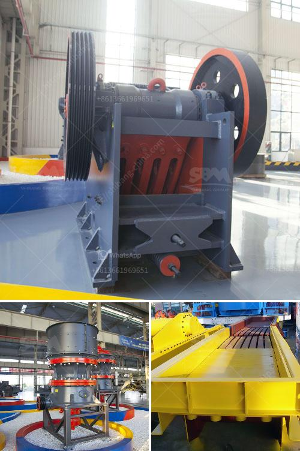

<h3>crusher plant price in ethiopia</h3>
Crusher plant price in Ethiopia is one of the leading factors for customers to choose crushing plant. Every customer pays attention to the price when purchasing crushing plant. Therefore, stone crushing plant manufacturers must take some factors into account when setting up crushing plant. Such as production capacity, quality, and the crushing strength of raw materials. First of all, the price of a mobile crusher plant depends on the selection of the main equipment. Limestone, clinker and granite are highly abrasive types of rock. Therefore, the design of a mobile crushing plant breaks through the constraint of traditional fixed crushing plants and its high transportation cost. It can deal with materials in nearby site which is widely applied in mining, metallurgy, building material, transportation, water conservancy and other industries. 

Recently, mobile crusher plant attracts more attention from customers because of its considerable advantages. Firstly, it integrated the whole unit according to the needs of customers. It eliminates the cumbersome site infrastructure and auxiliary facilities installation of the split-component, and reduces material consumption, manpower, hours. It realizes the flexible movement and convenient transition of construction waste processing, breaking the limitation of environment and sustainable development. Secondly, the plant has a quality crushing equipment. The mobile crushing plant applies the advanced technology with great flexibility and ease of movement. The crushing plant can be easily transported on highways and moved to crushing sites, so it is able to achieve on-site crushing without material transporting from one place to another place. In addition, it can be used as an independent crushing plant or can be combined with a mobile screening plant to provide more convenience and flexibility. 

Ethiopia’s infrastructure construction is developing rapidly, especially the construction of expressway which requires a large number of aggregates. In order to ensure the aggregate quality, win the trust of customers and take the construction site conditions into account, customers in Ethiopia have choice on cement making plant for cement industry. First of all, the investment in production is large, so strong financial strength is essential. Secondly, investors should be careful in selecting the site. The market situation of cement making plant in Ethiopia is also a very good yardstick for customers to choose between different manufacturers. After all, if the user chooses the wrong supplier, not only can the cost not be controlled, but also the equipment cannot be selected correctly. If you want good quality and low cost cement making plant equipment, you must choose a good cement making plant supplier.

In conclusion, the crusher plant price in Ethiopia will not only determine its success in Ethiopian market, but also bring a rich return on investment to mining investors. The mobile crushing plant breaks through the restriction of traditional fixed crushing plants and its high transportation cost. It has opened up a new operation mode for crushing plant in Ethiopia and facilitated infrastructure construction.
<h3>Contact us</h3><ul><li><strong>Whatsapp:&nbsp;<a href="https://wa.me/8613661969651">+8613661969651</a></strong></li><li><a href="https://swt.shibang-china.com/?git&amp;zhl&amp;crusher plant price in ethiopia"><strong>Online Service(chat now)</strong></a></li></ul><h3>Related</h3><ul><li><a href='wet grinding mill.md'>wet grinding mill</a></li><li><a href='cocoa processing plant in india.md'>cocoa processing plant in india</a></li><li><a href='stone crusher for sales in south philippines.md'>stone crusher for sales in south philippines</a></li><li><a href='production line to produce calcium carbonate.md'>production line to produce calcium carbonate</a></li><li><a href='quarry equipment leasing companies in nigeria.md'>quarry equipment leasing companies in nigeria</a></li></ul>