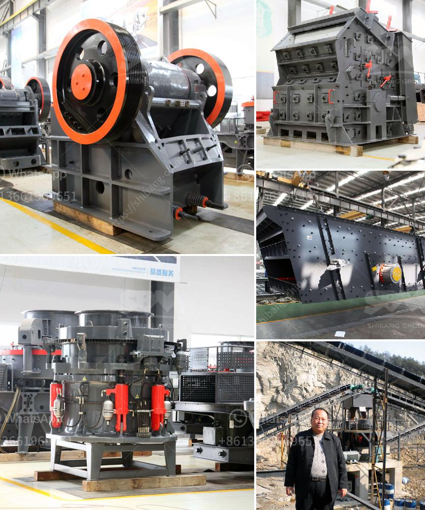

<h3>crusher plant structure</h3>
A crusher plant is a vital machine in the mining industry. It enables miners to crush the raw materials needed for further processing. When you invest in a crusher plant, you should understand its structure so you can make informed decisions about which equipment to buy.

A typical crusher plant consists of several components, including a crusher machine, screening machine, vibrating feeder, conveyors, and dust collectors. The crushing machine breaks the large-sized rocks and stones into smaller pieces suitable for further processing.

The primary crusher is responsible for reducing the size of the mined material. It typically accepts the largest rocks and breaks them into smaller pieces. The jaw crusher is commonly used for this purpose, as it features a fixed plate and a moving plate. These plates apply pressure to the rocks, which then break apart.

Once the material is reduced to a manageable size, it enters the secondary crusher. This machine further breaks down the rocks into even smaller pieces. The secondary crusher may be a cone crusher or impact crusher, depending on the requirements of the plant. Cone crushers are suitable for crushing harder stones, while impact crushers are ideal for softer ones.

After the material is crushed to the desired size, it moves towards the screening machine. The purpose of this machine is to classify the crushed material into different sizes. By doing so, it ensures that particles of the required size are correctly segregated for further use. The screening machine usually utilizes a vibrating screen or a trommel screen to accomplish this task.

Once the material is classified, it moves towards the conveyors. These machines transport various materials within the crusher plant. For instance, the crusher sends the crushed material to the screening machine via a conveyor belt. The screening machine then sends the classified material to another conveyor, which transfers it to the next stage in the processing plant.

Dust collectors are an essential component of a crusher plant. They extract and collect dust particles generated during the crushing process. By doing so, they help maintain a clean and healthy working environment. Dust collectors prevent dust from escaping into the air, reducing the risk of respiratory diseases among workers.

In conclusion, understanding the structure of a crusher plant is crucial when considering investing in one. The primary crusher breaks down large rocks, while the secondary crusher further reduces the material. The screening machine classifies the crushed material, and conveyors transport it within the plant. Dust collectors play a vital role in maintaining a clean and safe working environment. By grasping the essential components of a crusher plant, you can make informed decisions regarding the purchase and utilization of this machinery in your mining operations.
<h3>Contact us</h3><ul><li><strong>Whatsapp:&nbsp;<a href="https://wa.me/8613661969651">+8613661969651</a></strong></li><li><a href="https://swt.shibang-china.com/?git&amp;zhl&amp;crusher plant structure"><strong>Online Service(chat now)</strong></a></li></ul><h3>Related</h3><ul><li><a href='the production process of cobblestone.md'>the production process of cobblestone</a></li><li><a href='best machine brands for quarry.md'>best machine brands for quarry</a></li><li><a href='stone crushers poland.md'>stone crushers poland</a></li><li><a href='limestone ore processing plant.md'>limestone ore processing plant</a></li><li><a href='mining company from india.md'>mining company from india</a></li></ul>