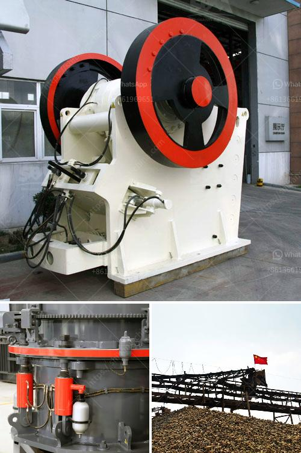

<h3>crusher price in europe</h3>
When it comes to investing in any kind of heavy machinery, like crushers, it is essential to consider various factors that impact the overall cost of ownership. In the case of crushers, these factors play a crucial role in determining the price in Europe. So, let's delve into these aspects, explore the market dynamics and understand the key influencers behind the crusher price in Europe.

One of the primary factors affecting the crusher price in Europe is the type of equipment. There is a wide range of crushers available in the market, such as jaw crushers, cone crushers, impact crushers, and gyratory crushers, each catering to different crushing needs. Each type of equipment has varying specifications, features, and capacities, which directly impact its price. For instance, jaw crushers tend to be more affordable compared to cone crushers due to their simpler construction and lower maintenance requirements.

Apart from the type of crusher, the size and capacity of the equipment also play a significant role in determining the price. Larger crushers with higher capacities are generally more expensive than smaller ones, as they require more robust construction, higher-quality materials, and advanced technologies to handle greater loads. Consequently, crushers with larger feed openings, wider discharge settings, and higher production rates tend to have higher price tags.

Moreover, another factor affecting the price of crushers in Europe is the brand and its reputation. Renowned brands that have a long-standing presence and a strong reputation for producing reliable and durable crushers often have a premium price attached to their products. These brands have invested significantly in research and development, incorporating innovations into their crushers, which set them apart from generic or lesser-known alternatives.

Furthermore, other factors, such as after-sales services, warranty, and customer support, can also impact the overall crusher price. Manufacturers that provide comprehensive after-sales services, including spare parts availability, on-site training, and technical support, tend to charge more for their products. However, such services ensure that the crusher operates optimally and minimizes downtime, resulting in long-term cost savings for the customer.

The state of the European economy and the supply and demand dynamics in the region also have an influence on crusher prices. Economic fluctuations, currency exchange rates, and market competition can cause price variations, with some periods experiencing higher prices due to increased demand or limited availability of certain crusher models or components.

In conclusion, the price of crushers in Europe is influenced by several factors, including the type, size, capacity, brand reputation, after-sales services, and the economic climate. Potential buyers should consider their specific crushing requirements, short-term and long-term operational costs, as well as the reliability and durability of the equipment before making a purchasing decision. Additionally, it is advisable to research and compare prices, specifications, and customer reviews from multiple manufacturers to ensure a fair and reasonable investment in a crusher that meets their needs.
<h3>Contact us</h3><ul><li><strong>Whatsapp:&nbsp;<a href="https://wa.me/8613661969651">+8613661969651</a></strong></li><li><a href="https://swt.shibang-china.com/?git&amp;zhl&amp;crusher price in europe"><strong>Online Service(chat now)</strong></a></li></ul><h3>Related</h3><ul><li><a href='new trends in concrete technology slide presentation.md'>new trends in concrete technology slide presentation</a></li><li><a href='the production process of cobblestone.md'>the production process of cobblestone</a></li><li><a href='iron ore processing machine cost.md'>iron ore processing machine cost</a></li><li><a href='used stone crushers dealer.md'>used stone crushers dealer</a></li><li><a href='100 tph hammer mill kenya.md'>100 tph hammer mill kenya</a></li></ul>