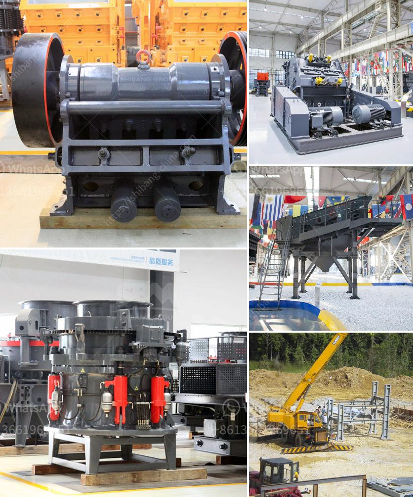

<h3>crusher price rock crusher price 8mm</h3>
When it comes to purchasing a rock crusher, the price is undeniably an important factor to consider. Whether you are a construction company or a mining operation, finding the right crusher at a competitive price is crucial for your operations' success.

One popular rock crusher in the market is the 8mm rock crusher. It is a versatile machine that can efficiently crush various materials to different sizes. But what factors determine the price of a rock crusher, specifically the 8mm variant? Let's delve into some important considerations:

1. Quality and Durability: The first and foremost factor influencing the price of a rock crusher is its quality and durability. A high-quality rock crusher made from robust materials will undoubtedly cost more than one of inferior quality. While it may be tempting to opt for a cheaper option initially, investing in a durable rock crusher will likely save you money in the long run as it will require less maintenance and have a longer lifespan.

2. Capacity and Output Size: The capacity and output size of the rock crusher are significant factors affecting the price. A rock crusher with a higher capacity and the ability to produce various output sizes will generally be priced higher. Therefore, it is essential to evaluate your specific needs and choose a rock crusher that can handle your desired workload and output requirements.

3. Design and Features: Different rock crushers come with varying designs and features, and these factors can influence their prices significantly. Some advanced features may include automated controls, adjustable settings, or specific applications tailored to different industries. Depending on your requirements, a more sophisticated design with added features may be necessary, incurring a higher price tag.

4. Brand Reputation: Brand reputation plays a crucial role in determining a rock crusher's price. Established brands with a proven track record of delivering reliable and high-performance crushers may come with a higher price due to their reputation and credibility. It is essential to consider the brand's reliability and customer reviews before making a purchase decision.

5. Market Demand and Competition: Supply and demand dynamics and competition among manufacturers can impact the pricing of rock crushers. If there is high demand for rock crushers in the market, manufacturers may charge a premium price. Conversely, increased competition can lead to competitive pricing, benefiting potential buyers.

In the case of the 8mm rock crusher, the price range can vary depending on the aforementioned factors. Generally, an 8mm rock crusher can range from $10,000 to $50,000 or more, depending on its capacity, features, and brand reputation. It is crucial to evaluate your specific needs and budget constraints while considering the best value for your investment.

In conclusion, purchasing a rock crusher can be a significant investment, and understanding the factors that determine the price is essential. The quality, capacity, features, brand reputation, and market dynamics all play a significant role in the final price. Conduct thorough research, compare different options, and consult experts in the field to make an informed decision that best suits your requirements and budget.
<h3>Contact us</h3><ul><li><strong>Whatsapp:&nbsp;<a href="https://wa.me/8613661969651">+8613661969651</a></strong></li><li><a href="https://swt.shibang-china.com/?git&amp;zhl&amp;crusher price rock crusher price 8mm"><strong>Online Service(chat now)</strong></a></li></ul><h3>Related</h3><ul><li><a href='turkey jaw crushers in istanbul.md'>turkey jaw crushers in istanbul</a></li><li><a href='clay grinder machine india.md'>clay grinder machine india</a></li><li><a href='crushers for sale saudi arabia.md'>crushers for sale saudi arabia</a></li><li><a href='rock crusher hammer mills for sale.md'>rock crusher hammer mills for sale</a></li><li><a href='brick crusher for sale.md'>brick crusher for sale</a></li></ul>