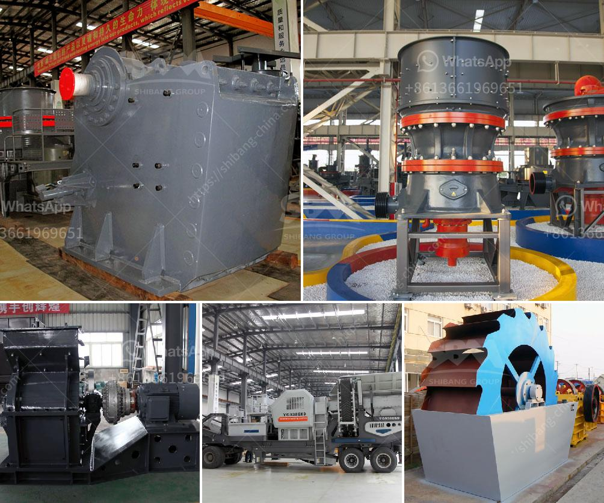

<h3>crusher santa marta malaysia</h3>
Crusher Santa Marta Malaysia, a leading supplier of efficient and high-quality crushing equipment, has quickly become a go-to option for various industries across the country. With its commitment to innovation, state-of-the-art technology, and exceptional customer service, the company has established itself as a trusted partner for businesses seeking reliable solutions for their diverse crushing needs.

The importance of high-quality crushing equipment cannot be overstated. Whether it is in the construction, mining, quarrying, or recycling industries, efficient crushers are pivotal for maximizing productivity, reducing operating costs, and achieving desired end products. Crusher Santa Marta Malaysia offers a comprehensive range of crushing and screening solutions designed to meet the specific needs of each customer.

At Crusher Santa Marta Malaysia, their team of skilled professionals possesses in-depth knowledge and expertise in the field of crushing technology. Constantly staying abreast of industry developments, they employ the latest innovations to enhance efficiency, boost operational performance, and maximize profitability for their clients. By employing cutting-edge research and development techniques, they ensure their machinery meets the highest standards of quality and performance.

Whether businesses require primary, secondary, or tertiary crushing solutions, Crusher Santa Marta Malaysia has a diverse range of equipment to offer. From jaw crushers and cone crushers to impact crushers and specialized machines for specific applications, the company's extensive product portfolio caters to all crushing requirements. Clients can choose from a variety of sizes, configurations, and capacities, ensuring they find the perfect machinery for their operations.

Understanding that no two businesses are the same, Crusher Santa Marta Malaysia prides itself on providing personalized customer service. Their team of experienced professionals works closely with clients to thoroughly understand their unique goals, operational requirements, and budgetary constraints. This collaborative approach enables them to recommend the most suitable equipment solutions, ensuring maximum efficiency and cost-effectiveness.

Crusher Santa Marta Malaysia is committed to providing machinery that is not only efficient but also durable and reliable. Investing in their equipment allows businesses to achieve long-term success and minimize costly downtime. With stringent quality control measures in place, their crushers undergo rigorous testing to ensure they can withstand the harsh operating conditions commonly found in various industries.

With its commitment to innovation, cutting-edge technology, and exceptional customer service, Crusher Santa Marta Malaysia has emerged as a preferred choice for businesses seeking reliable crushing equipment. It offers a wide range of solutions designed to increase productivity, reduce operating costs, and improve efficiency. By understanding the specific needs of each customer, the company ensures they receive machinery that fits their requirements perfectly. Investing in high-quality crushers from Crusher Santa Marta Malaysia equips businesses with the tools they need to excel in their respective industries, ultimately driving growth and success.
<h3>Contact us</h3><ul><li><strong>Whatsapp:&nbsp;<a href="https://wa.me/8613661969651">+8613661969651</a></strong></li><li><a href="https://swt.shibang-china.com/?git&amp;zhl&amp;crusher santa marta malaysia"><strong>Online Service(chat now)</strong></a></li></ul><h3>Related</h3><ul><li><a href='quarrying crusher machines south africa.md'>quarrying crusher machines south africa</a></li><li><a href='cone crusher price in china.md'>cone crusher price in china</a></li><li><a href='industrial uses of white marble powder.md'>industrial uses of white marble powder</a></li><li><a href='kenya cone crusher is manufactured.md'>kenya cone crusher is manufactured</a></li><li><a href='mobile vsi crusher.md'>mobile vsi crusher</a></li></ul>