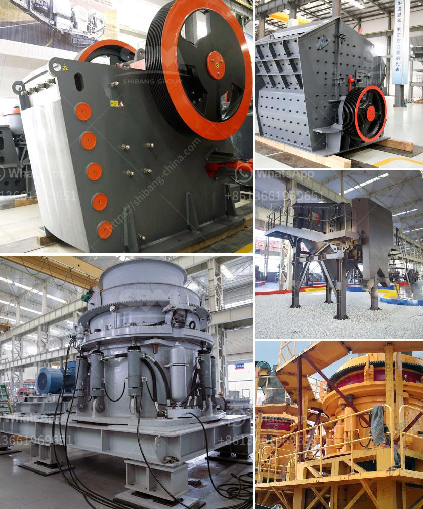

<h3>crusher stone crusher 1 ton peru</h3>
Crusher stone, also known as aggregate, is one of the most important materials used to construct buildings, roads, highways, and infrastructures in Peru. With the growth in the construction industry, the demand for crusher stone has increased significantly, leading to the development of the stone crushing industry.

One of the key players in this industry is the crusher stone crusher 1 ton Peru. This crusher stone crusher 1 ton Peru is a heavy-duty machine that crushes large stones into smaller pieces or aggregates for use in various construction projects. It is commonly used in road construction, building construction, and infrastructure development.

The crusher stone crusher 1 ton Peru is known for its robust construction and high efficiency. It can crush stones of various sizes, ranging from small pebbles to large boulders, thus making it suitable for different construction needs. The machine operates by applying enormous pressure on the stones to break them into smaller fragments, which can then be used in construction.

The crusher stone crusher 1 ton Peru offers several advantages for the construction industry. Firstly, it helps to reduce the cost of transportation by crushing the stones on-site, eliminating the need for additional transportation expenses. This not only saves money but also reduces the environmental impact associated with transporting stones from quarries to construction sites.

Secondly, the crusher stone crusher 1 ton Peru improves the quality of construction by providing consistent and uniform aggregates. This ensures that the construction materials have the required strength and durability. The machine also allows for the customization of aggregate sizes, allowing builders to meet specific project requirements.

Furthermore, the crusher stone crusher 1 ton Peru plays a crucial role in promoting sustainable construction practices. By recycling and reusing demolished concrete and construction waste, the machine contributes to a circular economy. It reduces the need for new raw materials and conserves natural resources.

In addition to its use in construction, the crusher stone crusher 1 ton Peru also finds applications in other industries. For example, it is used in the mining sector to crush rocks and minerals for further processing. The machine's versatility makes it a valuable asset in various industries, contributing to economic growth and development.

Although the crusher stone crusher 1 ton Peru brings numerous benefits, it is essential to consider the environmental impacts associated with stone crushing. Dust, noise, and vibrations are common concerns that need to be addressed to ensure sustainable and responsible stone crushing practices. Implementing effective mitigation measures, such as dust suppression systems and noise barriers, can help minimize these impacts.

In conclusion, the crusher stone crusher 1 ton Peru plays a vital role in the construction industry, providing high-quality aggregates for various building projects. Its robust construction, efficiency, and versatility make it a valuable asset in the construction and mining sectors. However, it is important to ensure responsible and sustainable stone crushing practices to minimize environmental impacts. With proper measures in place, the crusher stone crusher 1 ton Peru offers a promising future for the construction industry in Peru.
<h3>Contact us</h3><ul><li><strong>Whatsapp:&nbsp;<a href="https://wa.me/8613661969651">+8613661969651</a></strong></li><li><a href="https://swt.shibang-china.com/?git&amp;zhl&amp;crusher stone crusher 1 ton peru"><strong>Online Service(chat now)</strong></a></li></ul><h3>Related</h3><ul><li><a href='magnesium sulfate production line equipment.md'>magnesium sulfate production line equipment</a></li><li><a href='machine of ultra fine mills.md'>machine of ultra fine mills</a></li><li><a href='kaolin crusher manufacturers in uk.md'>kaolin crusher manufacturers in uk</a></li><li><a href='basalt manufacturer crusher machine.md'>basalt manufacturer crusher machine</a></li><li><a href='dental stone jaw crusher.md'>dental stone jaw crusher</a></li></ul>