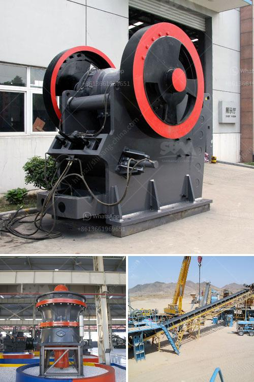

<h3>crusher stone price bolivia</h3>
Crusher stone, also known as crushed stone or angular rock, is one of the most commonly used construction materials. It is widely utilized for foundations, roads, landscaping, and building structures. However, the price of crusher stone varies depending on various factors such as its quality, transportation costs, and market demand.

First and foremost, the quality of crusher stone plays a crucial role in determining its price. High-quality stones are usually more durable, have a uniform size, and are free from impurities. Such stones are often in high demand and, therefore, tend to have a higher price. On the other hand, lower-quality stones may have irregular shapes, be prone to crumbling, or contain impurities, making them less desirable and more affordable.

Transportation costs are another major factor influencing the price of crusher stone. Bolivia, being a landlocked country, may experience higher transportation costs compared to coastal regions. The distance between the stone quarry and the customer's location affects transportation costs. Longer distances generally translate into higher prices due to increased fuel consumption and transportation fees.

Market demand and competition also impact crusher stone prices in Bolivia. A higher demand for construction materials in the region can drive prices up due to increased competition among suppliers. Conversely, a decrease in demand may lead to lowered prices as suppliers try to attract customers. It is crucial to keep an eye on market trends and anticipate fluctuations to make informed buying decisions.

Additionally, economic factors within Bolivia and globally, such as inflation rates, foreign currency exchange rates, and changes in trade policies, can indirectly affect the price of crusher stone. These factors can impact the cost of materials and, in turn, influence the pricing strategies of suppliers.

In conclusion, understanding the pricing factors of crusher stone is important for individuals and businesses involved in construction projects in Bolivia. Higher quality stones, longer transportation distances, market demand, and economic conditions are key determinants of price. By considering these factors, customers can make informed decisions and obtain the best value for their investment in crusher stone.
<h3>Contact us</h3><ul><li><strong>Whatsapp:&nbsp;<a href="https://wa.me/8613661969651">+8613661969651</a></strong></li><li><a href="https://swt.shibang-china.com/?git&amp;zhl&amp;crusher stone price bolivia"><strong>Online Service(chat now)</strong></a></li></ul><h3>Related</h3><ul><li><a href='roller raymond mill.md'>roller raymond mill</a></li><li><a href='list of machinery used in the quarry.md'>list of machinery used in the quarry</a></li><li><a href='aggregates crusher plant near in manila.md'>aggregates crusher plant near in manila</a></li><li><a href='barium carbonate manufacturing process.md'>barium carbonate manufacturing process</a></li><li><a href='standar operasional prosedur batubara mininh.md'>standar operasional prosedur batubara mininh</a></li></ul>