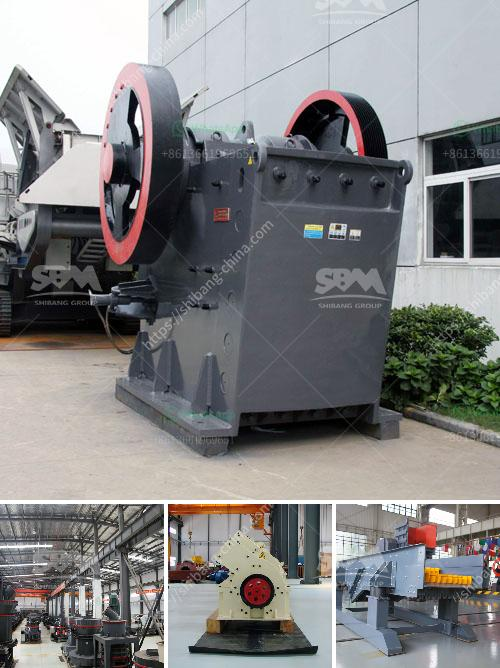

<h3>crusher unit price in kerala</h3>
The crusher unit price in Kerala, a topic of concern for many people, has been trending in the news recently. It is an important discussion because the price of rock crushers, which are necessary for building construction and infrastructure development, cannot be overlooked. With discussions revolving around the price of these units, it becomes crucial to understand the factors that influence them.

One of the primary factors contributing to the crusher unit price in Kerala is the cost of raw materials. The raw materials required for the production of rock crushers include metals, stones, and other aggregates. The availability and cost of these materials vary from one region to another. In Kerala, the cost of raw materials can be higher due to transportation expenses and local market dynamics.

Another significant aspect that affects the price of crusher units in Kerala is the cost of labor. Skilled labor is required during the manufacturing process, and their wages can vary based on location and expertise. Kerala, known for its educated workforce, generally has higher labor costs compared to other regions. These costs are often reflected in the final price of the units.

The technology and machinery used for manufacturing crushers also influence their price. Upgrading equipment to enhance productivity and efficiency involves additional expenses, which might be passed on to the end consumer. With advancements in technology, manufacturers continuously invest in updated machinery, impacting the final unit price.

Transportation and logistics play a significant role in determining the cost of crusher units in Kerala. Kerala's geography, characterized by hills, rivers, and coastal areas, can pose challenges in terms of transportation. The cost of transporting the units from the manufacturing site to different parts of Kerala varies, in turn, affecting the unit price.

Government policies and regulations are another crucial factor affecting the crusher unit price in Kerala. Taxes, permits, and other bureaucratic requirements can increase the manufacturing cost, prompting manufacturers to adjust the price accordingly. Understanding the impact of government policies is essential for both manufacturers and consumers.

Competition in the market also influences the crusher unit price in Kerala. When multiple manufacturers offer similar products, there is a competitive pricing strategy in play. Manufacturers may adjust their prices to attract more customers, resulting in a fluctuating market. In a competitive scenario, consumers can benefit from better prices on the units.

In conclusion, the crusher unit price in Kerala is influenced by several factors. Raw material costs, labor expenses, technology and machinery, transportation and logistics, government policies, and market competition all contribute to the final unit price. Understanding these factors helps manufacturers and consumers make informed decisions. It is important for consumers to research and compare prices from different manufacturers to find the best deal without compromising quality. With ongoing discussions surrounding the price of crusher units in Kerala, it is crucial to stay updated on market trends and industry developments.
<h3>Contact us</h3><ul><li><strong>Whatsapp:&nbsp;<a href="https://wa.me/8613661969651">+8613661969651</a></strong></li><li><a href="https://swt.shibang-china.com/?git&amp;zhl&amp;crusher unit price in kerala"><strong>Online Service(chat now)</strong></a></li></ul><h3>Related</h3><ul><li><a href='hammer mill gauteng.md'>hammer mill gauteng</a></li><li><a href='stone crushing plant supplier south africa.md'>stone crushing plant supplier south africa</a></li><li><a href='stone crusher machine price in south africa.md'>stone crusher machine price in south africa</a></li><li><a href='hammer vibrating screens usa.md'>hammer vibrating screens usa</a></li><li><a href='malaysia crusher plant manufacturer and supplier.md'>malaysia crusher plant manufacturer and supplier</a></li></ul>