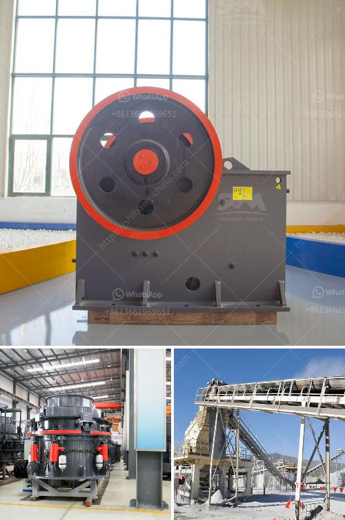

<h3>crusher used for copper ore</h3>
Copper is one of the earliest discovered and used metals. Because of its excellent electrical conductivity, thermal conductivity, and ductility, copper has become the preferred material for numerous industrial applications. Copper ore is mined from copper veins and it is crushed and ground into powder for further processing. Copper ore crusher refers to the crusher that mainly deactivates copper ore materials.

Copper ore is generally a mixture of different minerals. Some copper ores contain native copper, chalcopyrite, pyrite, malachite, azurite, etc. These minerals are not easy to separate, and copper ore crusher plays an important role in the copper ore mining process.

The process of copper ore crushing is mainly divided into three stages: primary crushing, secondary crushing, and fine crushing. In the primary crushing stage, the raw materials are evenly sent to the jaw crusher by the vibrating feeder for coarse crushing. In the secondary crushing stage, cone crusher or impact crusher is used to further crush larger size copper ore particles. Lastly, in the fine crushing stage, vibrating screens are utilized to separate the crushed copper ore particles based on their size.

There are various types of crushers used for copper ore crushing, such as jaw crushers, cone crushers, roll crushers, impact crushers, etc. Jaw crusher is the primary crushing equipment used in copper ore crushing plant. It is an important mining tool that enables efficient and effective crushing of copper ore and facilitates the extraction process. Jaw crusher can reach the crushing ratio of 4-6 and the shape of final product is even. It is widely applied to crush high hardness, mid hardness and soft rocks and ores such as slag, construction materials, marble, etc.

Cone crusher, on the other hand, is used to crush medium and high hardness materials like copper ore and granite. It has longer service life compared to other crushers due to its optimized structure, hydraulics, and wear-resistant materials. Roll crushers, also known as double roll crushers, are ideal for treating copper ore with compressive strength less than 80MPa and water content less than 20%. Impact crushers, on the other hand, are commonly used for the processing of softer minerals and materials like limestone, phosphate, clay, coal, and copper ore.

The utilization of crushers for copper ore processing offers numerous benefits. Firstly, it aids in reducing the amount of ore extracted from the earth, thereby conserving natural resources. Secondly, it allows for efficient and cost-effective separation of valuable copper minerals from gangue minerals. Additionally, crushers help in reducing the size of the ore particles, enabling easier transportation and processing. This ultimately results in better productivity, reduced energy consumption, and lower operating costs for copper mines.

In conclusion, crushers are crucial equipment in the copper ore mining process. They efficiently crush the mined copper ore into smaller particles, allowing for easier extraction and processing. With the development of technology, various types of crushers are available to suit different requirements and applications. Investing in high-quality copper ore crushers can yield significant benefits for mining companies, leading to increased efficiency and profitability.
<h3>Contact us</h3><ul><li><strong>Whatsapp:&nbsp;<a href="https://wa.me/8613661969651">+8613661969651</a></strong></li><li><a href="https://swt.shibang-china.com/?git&amp;zhl&amp;crusher used for copper ore"><strong>Online Service(chat now)</strong></a></li></ul><h3>Related</h3><ul><li><a href='coal grinding mill in india.md'>coal grinding mill in india</a></li><li><a href='coal preparation plant cost.md'>coal preparation plant cost</a></li><li><a href='mobile dms copper concentrate machine.md'>mobile dms copper concentrate machine</a></li><li><a href='france roller mills.md'>france roller mills</a></li><li><a href='stone crusher plant price in india.md'>stone crusher plant price in india</a></li></ul>