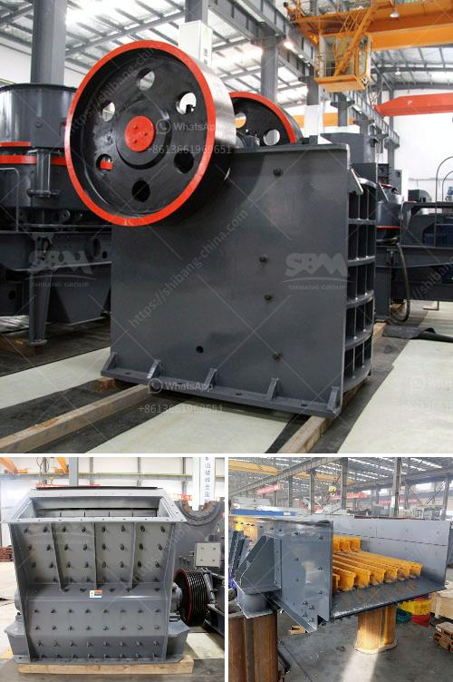

<h3>crushers and screeners for sale</h3>
Crushers and screeners are essential machines used in the mining and construction industries. They are designed to break larger rocks and stones into smaller pieces and separate them into different sizes. These machines play a vital role in various applications, such as quarrying, recycling, and demolition projects. If you are in the market for crushers and screeners, there are several aspects you should consider before making a purchase.

Firstly, it is important to understand the different types of crushers and screeners available in the market. Crushers can be categorized into various types based on their operating principles, such as jaw crushers, impact crushers, cone crushers, and gyratory crushers. Each type has its own unique advantages and is designed for specific applications. Similarly, screeners or screening machines come in different varieties, such as vibrating screens, trommel screens, and grizzly screens. These machines are used to separate materials based on their size, ensuring efficient processing and reducing waste.

Once you have determined the type of crusher or screener you need, it is crucial to consider factors such as capacity, power consumption, and maintenance requirements. The capacity of the machine should align with your production needs. You must assess your project's scale and output demands to ensure the machine can handle the workload effectively. Additionally, it is important to consider the power consumption of the machine to ensure it operates efficiently and cost-effectively. Taking into account the maintenance requirements will help you estimate the long-term costs associated with operating and servicing the machine.

Another crucial aspect to consider is the quality and reliability of the crushers and screeners available for sale. Investing in a durable and reliable machine will ensure its longevity and minimize downtime. It is essential to choose a reputable supplier or manufacturer who offers machines built with high-quality materials and components.

Furthermore, it is worth exploring the available features and technological advancements in crushers and screeners. Modern machines often come equipped with innovative features such as remote control operation, advanced monitoring systems, and automation, which can enhance productivity, safety, and efficiency. These features can significantly improve your overall operational experience and performance.

Lastly, it is advisable to compare prices and warranties offered by different suppliers. While cost is an important factor, it should not be the sole determinant of your purchasing decision. Ensure that the price aligns with the machine's specifications, quality, and performance. Additionally, it is crucial to assess the warranty and after-sales support provided by the supplier to safeguard your investment and minimize any potential downtime.

In conclusion, crushers and screeners are vital machines used in mining and construction industries. Before purchasing, it is essential to understand the different types available, consider factors such as capacity, power consumption, and maintenance requirements, and assess the quality and reliability of the machines. Exploring features and technological advancements and comparing prices and warranties will help you make an informed decision. By investing in the right crushers and screeners, you can optimize your operations, increase productivity, and achieve maximum returns on your investment.
<h3>Contact us</h3><ul><li><strong>Whatsapp:&nbsp;<a href="https://wa.me/8613661969651">+8613661969651</a></strong></li><li><a href="https://swt.shibang-china.com/?git&amp;zhl&amp;crushers and screeners for sale"><strong>Online Service(chat now)</strong></a></li></ul><h3>Related</h3><ul><li><a href='maize grinding mill in philippines south africa.md'>maize grinding mill in philippines south africa</a></li><li><a href='kenya cone crusher is manufactured.md'>kenya cone crusher is manufactured</a></li><li><a href='crusher for marble.md'>crusher for marble</a></li><li><a href='what is a mobile crusher.md'>what is a mobile crusher</a></li><li><a href='how does it hammer mill operats.md'>how does it hammer mill operats</a></li></ul>