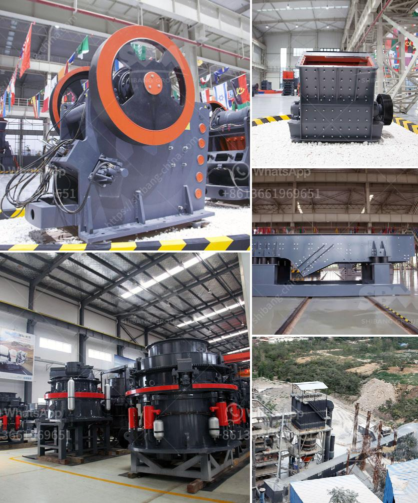

<h3>crushers for sale saudi arabia</h3>
With the ongoing development in infrastructure, construction industry is experiencing a boom in Saudi Arabia. As a result, there is a growing demand for crushers for sale in the kingdom's numerous construction projects. A wide range of materials, such as concrete, glass, ceramics, limestone, gypsum and even recyclable materials, can be processed and crushed efficiently using crushers. The demand for these machines is constantly increasing due to their ability to process construction waste, making them an essential equipment in the construction industry.

One of the main advantages of using crushers is their ability to reduce the size of larger rocks, making them suitable for transportation and further processing. They crush the rocks to an optimum size for various construction purposes, such as road construction, building foundations, and concrete production. Crushers come in various sizes and types to meet the diverse needs of construction projects. From jaw crushers and cone crushers to impact crushers and hammer crushers, they provide different crushing capabilities to achieve the desired end product.

In Saudi Arabia, crushers are mainly used for crushing stones or rocks into small pieces for construction aggregate production, concrete recycling, and building materials production. Users of crushers in Saudi Arabia are mainly concrete and construction companies. Construction materials such as aggregated rock materials are needed to build infrastructure projects and residential communities. Consequently, crushers play an essential role in the production of aggregates needed to fulfill the demand for construction materials.

The construction sector in Saudi Arabia is witnessing considerable growth, which is driving the demand for crushers. The increasing number of residential and commercial buildings, as well as infrastructure projects such as roads, bridges, and airports, necessitate the use of crushers for crushing materials at various stages of construction. Additionally, crushers are also used in quarries to extract aggregates, which are then used for construction purposes.

Saudi Arabia is home to a significant number of crushers companies that operate to supply crushers to the market. Companies such as Abdullah Ahmad Al-Dossary Holding Co., Arabian Gulf Crushing and Screening, Al-Kifah Batching Plant, and Tamimi Group are among the leading crushers manufacturers in the kingdom. Their diverse range of crushers ensures that Saudi Arabia construction projects obtain the required aggregate sizes.

Moreover, crushers for sale in Saudi Arabia are equipped with state-of-the-art technology, such as computerized control systems, and advanced electronic management systems. These advanced systems ensure proper utilization of energy and resources, resulting in improved efficiency and productivity during the crushing process. Additionally, crushers are also equipped with safety features, such as emergency shut-off switches and easy-to-access maintenance points to guarantee the safety of workers operating them.

In conclusion, crushers play a crucial role in the construction industry in Saudi Arabia. As the kingdom continues to develop its infrastructure and urban areas, the demand for construction materials increases. This, in turn, drives the need for crushers that can process and crush various materials efficiently. As a result, crushers are an essential equipment for construction companies in Saudi Arabia, allowing them to meet the demand for construction materials, contribute to the Kingdom's economic growth, and shape its skyline.
<h3>Contact us</h3><ul><li><strong>Whatsapp:&nbsp;<a href="https://wa.me/8613661969651">+8613661969651</a></strong></li><li><a href="https://swt.shibang-china.com/?git&amp;zhl&amp;crushers for sale saudi arabia"><strong>Online Service(chat now)</strong></a></li></ul><h3>Related</h3><ul><li><a href='price crusher 30 ton.md'>price crusher 30 ton</a></li><li><a href='stamp mill for sale in south africa.md'>stamp mill for sale in south africa</a></li><li><a href='stone crushers from china.md'>stone crushers from china</a></li><li><a href='ball mill for silica sand.md'>ball mill for silica sand</a></li><li><a href='crusher machine plant estimation cost.md'>crusher machine plant estimation cost</a></li></ul>