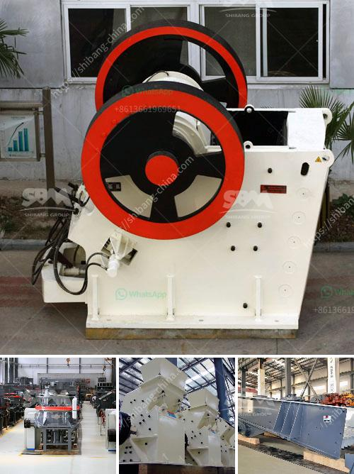

<h3>crushers screeners conveyor manufacturers in india</h3>
In recent years, India has witnessed a significant increase in infrastructure development. This boom in the construction industry has led to a rising demand for crushers, screeners, and conveyor manufacturers in the country. These equipment are essential for efficient and effective crushing, screening, and conveying of materials in various industries such as mining, construction, and recycling.

One of the key players in this evolving market is the Indian company, Propel Industries. Established in 2002, Propel Industries provides innovative, technologically advanced, and cost-effective solutions for crushing, screening, and conveying applications. The company offers a wide range of jaw crushers, cone crushers, vertical shaft impactors, and screens to suit different project requirements.

Another prominent player in the Indian market is L&T Metso, a joint venture between Larsen & Toubro and Metso Corporation. L&T Metso offers a comprehensive range of crushing solutions from jaw crushers to impactors and mobile crushing plants.

Apart from these major players, there are several other crusher, screener, and conveyor manufacturers in India. These include Sandvik India, Torsa Machines Limited, AMARSHIVA Engineering Company, and Puzzolana Group.

The advancement in technology and the growing need for quality and reliable equipment have led these companies to bring in new and innovative products. For instance, Sandvik India offers the state-of-the-art QJ341 Mobile Jaw Crusher, which utilizes the latest technology to deliver efficient primary crushing. Similarly, Propel Industries has developed the most advanced cone crusher to suit the diverse needs of the industry.

In addition to crushers and screeners, conveyors play a crucial role in the material handling process. They are responsible for transferring the crushed materials from one stage to another. In India, there are several conveyor manufacturers offering a wide range of conveyors such as belt conveyors, screw conveyors, bucket elevators, and slat conveyors.

One of the leading conveyor manufacturers in India is Bevcon Wayors. They are known for their innovative and high-quality conveyor systems that cater to various industries. Bevcon Wayors offers custom-designed conveyor solutions to meet the specific requirements of their clients.

Another noteworthy player in the market is Tega Industries. They specialize in providing conveyor components and accessories such as pulleys, idlers, and belt cleaners. Tega Industries is renowned for its high-quality and durable products that ensure optimal performance and productivity.

The increasing demand for crushers, screeners, and conveyors in India can be attributed to the growing infrastructure projects, urbanization, and rise in mining activities. These equipment are essential for efficient and timely completion of construction projects, as well as for mining and quarrying operations.

As the Indian market continues to expand, manufacturers are striving to deliver technologically advanced and cost-effective solutions to meet the evolving needs of the industry. With their innovative products and dedication to customer satisfaction, crushers, screeners, and conveyor manufacturers in India are making significant contributions to the development of the country's infrastructure sector.
<h3>Contact us</h3><ul><li><strong>Whatsapp:&nbsp;<a href="https://wa.me/8613661969651">+8613661969651</a></strong></li><li><a href="https://swt.shibang-china.com/?git&amp;zhl&amp;crushers screeners conveyor manufacturers in india"><strong>Online Service(chat now)</strong></a></li></ul><h3>Related</h3><ul><li><a href='bentonite powder plant in surat.md'>bentonite powder plant in surat</a></li><li><a href='philippines crusher cebu crusher.md'>philippines crusher cebu crusher</a></li><li><a href='mtm grinding mill.md'>mtm grinding mill</a></li><li><a href='mining crusher plant limestone process.md'>mining crusher plant limestone process</a></li><li><a href='used rock fine crusher for sale.md'>used rock fine crusher for sale</a></li></ul>