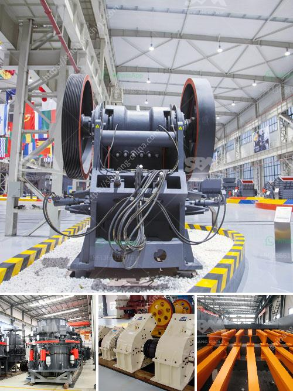

<h3>crushing & screening equipment</h3>
Crushing and screening equipment plays a vital role in several major industries. Used separately or in tandem, crushing and screening equipment are essential for constructing roadways, buildings, and mining materials. They ensure the effective and efficient extraction, crushing, and processing of raw materials.

Crushing and screening equipment consist of a variety of mechanical tools and devices. Different types of equipment are suitable for different crushing and screening tasks. These range from large primary jaw crushers and secondary cone crushers, to gyratory crushers and vibrating screens. Depending on the application, stationary, mobile, or portable versions are available.

The process of crushing and screening enables contractors to size and separate waste material to make a quality product that can then be reused or sold, creating a profit. In addition, crushing and screening reduces the environmental impact of mining by reducing the need for primary extraction of raw materials. This helps to conserve natural resources, as well as minimize pollution and waste.

One of the main advantages of using crushing and screening equipment is its versatility. Crushing and screening equipment can be used for a wide range of applications and configurations. While compact sizes are ideal for urban areas, different sizes and configurations can overcome obstacles on the site or allow for easy transportability. For example, a portable crusher or screening plant might be able to operate at a construction site or a mine gate, while stationary equipment needs to be set up on site.

Reliability is also an important aspect to consider when choosing crushing and screening equipment. The equipment needs to be durable and reliable in order to withstand harsh conditions for extended periods of time. Regular maintenance is required to keep the equipment in top condition and minimize downtime.

In addition to size, capacity, and reliability, another key factor to consider when purchasing crushing and screening equipment is the initial and ongoing costs associated with the equipment. Different equipment comes with different price tags, and it is essential to evaluate the upfront investment as well as the projected operational costs and potential return on investment.

Furthermore, technological advancements have led to the development of more innovative crushing and screening equipment. For example, automation technology can help optimize the performance and efficiency of crushing and screening processes. This can lead to a more streamlined and cost-effective operation.

In conclusion, crushing and screening equipment is integral to various industries including construction, mining, and recycling. It allows for efficient extraction, crushing, and processing of raw materials, reducing environmental impact and creating profits. Versatility, reliability, capacity, and cost are important factors to consider when choosing the appropriate equipment for any specific application. With advancing technology, the industry continues to evolve, providing more efficient and innovative solutions to meet the needs of the market.
<h3>Contact us</h3><ul><li><strong>Whatsapp:&nbsp;<a href="https://wa.me/8613661969651">+8613661969651</a></strong></li><li><a href="https://swt.shibang-china.com/?git&amp;zhl&amp;crushing  screening equipment"><strong>Online Service(chat now)</strong></a></li></ul><h3>Related</h3><ul><li><a href='usa vertical roller mill.md'>usa vertical roller mill</a></li><li><a href='clay grinder machine india.md'>clay grinder machine india</a></li><li><a href='ethiopia unused cone crusher for sale.md'>ethiopia unused cone crusher for sale</a></li><li><a href='raymond mill spare part.md'>raymond mill spare part</a></li><li><a href='closs size setting jaw crusher.md'>closs size setting jaw crusher</a></li></ul>