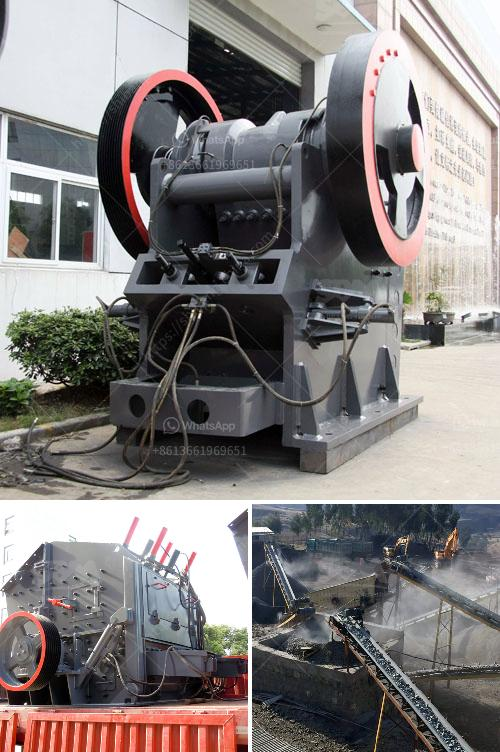

<h3>crushing and screening for sale</h3>
Crushing and screening equipment play a crucial role in the construction and mining industries, aiding in the extraction and processing of various types of raw materials. Whether it's gravel, rock, stone, or minerals, the process of crushing and screening is essential for enhancing their usability and turning them into valuable products. For industries seeking efficient and cost-effective solutions, there is an array of crushing and screening equipment available for sale.

When it comes to crushing, different machines are used to break down the raw materials into smaller, more manageable pieces. Crushers, such as cone crushers, impact crushers, and jaw crushers, are commonly utilized in this process. These machines use mechanical force to compress the materials, reducing their size and making them suitable for further processing.

After crushing, the next step is screening, which involves separating the crushed material into different sizes or categories. Screening equipment, such as vibrating screens and trommels, are used to achieve this. The material is fed onto a screen, which vibrates or rotates, allowing smaller particles to pass through while larger ones are retained. This helps ensure that the final product meets specific size requirements.

For businesses in need of crushing and screening equipment, there is a wide range of options to choose from. Many manufacturers offer machinery designed for various applications and sizes of operations. These machines can be purchased new or used, depending on budgetary constraints and specific requirements.

When considering purchasing crushing and screening equipment, it is essential to evaluate factors such as capacity, efficiency, ease of maintenance, and overall cost-effectiveness. Conducting thorough research and consulting with industry experts can ensure that the chosen equipment meets the needs of the business.

In conclusion, crushing and screening equipment are vital components of the construction and mining industries. They enable the extraction and processing of raw materials, transforming them into valuable products. Whether it's for building roads, manufacturing concrete, or producing aggregates, there is a vast selection of crushing and screening equipment available for sale, catering to different needs and budgets. Investing in the right machinery can enhance productivity, improve efficiency, and deliver high-quality products.
<h3>Contact us</h3><ul><li><strong>Whatsapp:&nbsp;<a href="https://wa.me/8613661969651">+8613661969651</a></strong></li><li><a href="https://swt.shibang-china.com/?git&amp;zhl&amp;crushing and screening for sale"><strong>Online Service(chat now)</strong></a></li></ul><h3>Related</h3><ul><li><a href='mini stone jaw crushers.md'>mini stone jaw crushers</a></li><li><a href='cement factory equipment list.md'>cement factory equipment list</a></li><li><a href='portable hammer mill for gold ore.md'>portable hammer mill for gold ore</a></li><li><a href='philippines crusher cebu crusher.md'>philippines crusher cebu crusher</a></li><li><a href='almeida stone crusher.md'>almeida stone crusher</a></li></ul>