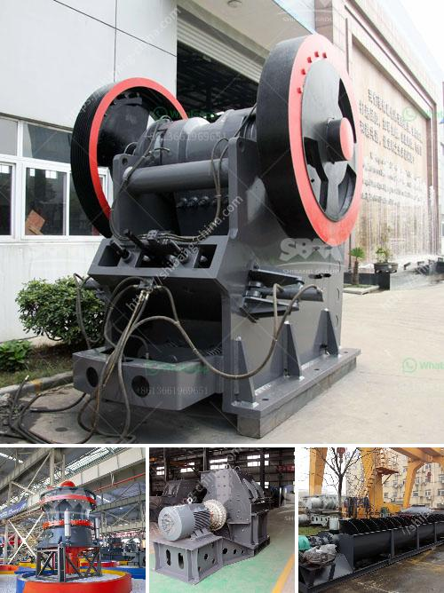

<h3>crushing and screening of aggregates in mexico</h3>
Mexico is a rapidly growing country with a booming construction industry. As construction projects continue to rise, the demand for aggregates such as sand, gravel, and crushed stones has increased significantly. The process of crushing and screening these aggregates plays a crucial role in ensuring their quality and suitability for various construction applications.

The crushing and screening process involves extracting rocks from the earth and reducing them to smaller sizes that can be used in construction projects. This process is essential as it helps remove impurities and ensures uniformity in the final product. Additionally, it enhances the aggregate's strength, durability, and overall performance.

In Mexico, several companies are specializing in crushing and screening aggregates to cater to the growing construction industry's needs. These companies utilize state-of-the-art equipment and machinery to achieve efficient and effective results. For instance, jaw crushers, cone crushers, and impact crushers are commonly used for primary, secondary, and tertiary crushing, respectively. Vibrating screens and scalping screens further separate the crushed stones into different sizes.

One of the main benefits of crushing and screening aggregates is the versatility it offers in various construction applications. These aggregates can be used in the production of concrete, asphalt, and road base materials. They serve as the foundation for building structures, roads, and infrastructure projects. Furthermore, fine aggregates produced through crushing and screening can also be used as fillers in mortar and landscaping.

With the construction industry at the forefront of Mexico's economic growth, crushing and screening operations are accelerating the pace of development. The availability of high-quality aggregates ensures that construction projects meet stringent standards and regulations. This is especially important for large-scale infrastructure projects that require strong and durable materials.

Moreover, the process of crushing and screening aggregates also contributes to sustainable development and environmental preservation. Recycling materials such as concrete and asphalt can reduce the need for extracting new aggregates from natural resources, minimizing the industry's ecological footprint. Additionally, integrating measures to decrease dust emissions and noise pollution during crushing and screening operations helps mitigate their impact on the environment and surrounding communities.

However, there are challenges associated with the crushing and screening of aggregates in Mexico. As the demand for aggregates continues to rise, maintaining sufficient supply becomes crucial. Ensuring a steady supply chain of raw materials from quarries to crushing and screening plants is necessary to meet market demands consistently. Additionally, transportation logistics must be efficiently managed to minimize delays and ensure timely delivery of the final product.

In conclusion, the crushing and screening of aggregates in Mexico plays a vital role in driving the construction industry forward. This process transforms raw materials into high-quality aggregates that serve as the backbone of various construction projects. It offers versatility, sustainability, and adherence to regulations, ensuring the successful completion of infrastructure projects across the country. As the demand for aggregates continues to surge, investing in advanced equipment, efficient supply chains, and sustainable practices becomes pivotal for the industry's growth and development.
<h3>Contact us</h3><ul><li><strong>Whatsapp:&nbsp;<a href="https://wa.me/8613661969651">+8613661969651</a></strong></li><li><a href="https://swt.shibang-china.com/?git&amp;zhl&amp;crushing and screening of aggregates in mexico"><strong>Online Service(chat now)</strong></a></li></ul><h3>Related</h3><ul><li><a href='portable stone crusher rajasthan.md'>portable stone crusher rajasthan</a></li><li><a href='conveyor belting manufacturers.md'>conveyor belting manufacturers</a></li><li><a href='hard rock crushers.md'>hard rock crushers</a></li><li><a href='cost of crusher machine for grinding mica.md'>cost of crusher machine for grinding mica</a></li><li><a href='cement production plant.md'>cement production plant</a></li></ul>