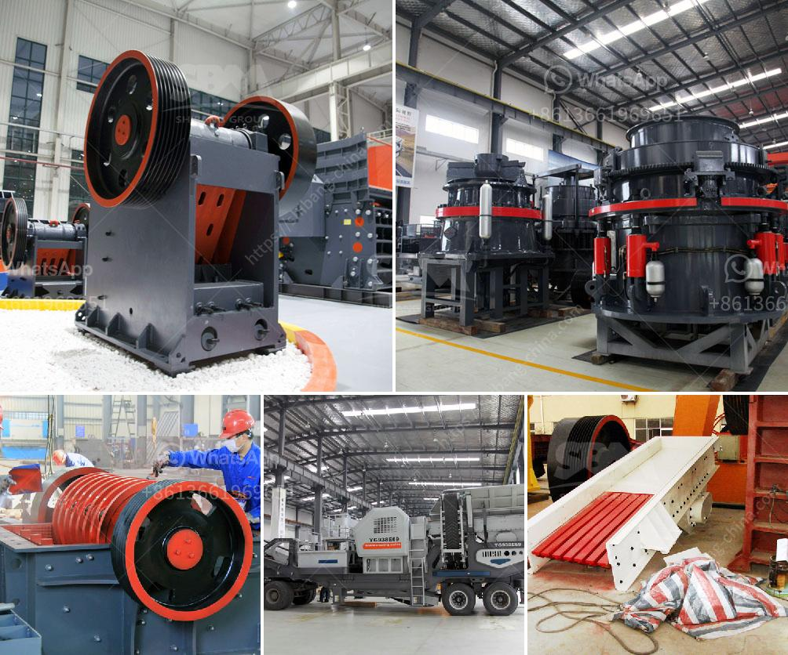

<h3>crushing and screening simulation software</h3>
In today's fast-paced world of construction and mining, efficiency is key. Companies need to optimize their processes, reduce costs, and maximize production. One valuable tool that has emerged to aid in this optimization is crushing and screening simulation software. This sophisticated software allows companies to simulate and analyze various crushing and screening scenarios, providing valuable insights that can greatly enhance their operational efficiency.

Crushing and screening simulation software utilizes mathematical modeling techniques, such as discrete element method (DEM), to simulate the behavior of a system or process. It enables users to visualize and analyze the flow of materials through different stages of their operations, such as crushing, screening, and sorting. By replicating real-world conditions within a virtual environment, companies can explore different strategies and assess the effects of various operational variables on productivity, efficiency, and profitability.

1. Optimal Equipment Selection: Utilizing crushing and screening simulation software allows companies to determine the most suitable equipment for their specific needs. By considering factors like capacity, power consumption, and material characteristics, the software can assist in selecting the right machines to achieve desired production levels.

2. Process Optimization: The software aids in the optimization of processing workflows by allowing companies to experiment with different configurations and settings. Simulations simulate the dynamic behavior of the plant, enabling managers to identify bottlenecks, fine-tune operations, improve circuit designs, and make data-driven decisions to enhance overall efficiency.

3. Predictive Maintenance: Understanding how equipment is likely to wear and perform over time is crucial in preventing unexpected breakdowns. By running simulations, potential issues with equipment, such as overloading or inefficient power usage, can be detected in advance. This information ensures timely maintenance and reduces costly downtime.

4. Cost Reduction: Simulation software allows for scenario testing and analysis, enabling continuous improvement. By identifying and rectifying inefficiencies, companies can reduce costs associated with excess energy consumption, excessive wear and tear, and underutilization of capacity. These adjustments lead to improved energy efficiency, longer equipment lifespan, and fewer material wastage, resulting in higher profitability.

Crushing and screening simulation software has revolutionized the construction and mining industry by providing a virtual testing ground for process optimization. With the ability to replicate real-world conditions, companies can accurately assess different crushing and screening scenarios. By doing so, they can improve equipment selection, optimize processes, enhance predictive maintenance, and ultimately reduce costs, resulting in more productive and profitable operations overall. As technology continues to evolve, simulation software will further unlock potential efficiencies and assist companies in staying competitive in today's dynamic business environment.
<h3>Contact us</h3><ul><li><strong>Whatsapp:&nbsp;<a href="https://wa.me/8613661969651">+8613661969651</a></strong></li><li><a href="https://swt.shibang-china.com/?git&amp;zhl&amp;crushing and screening simulation software"><strong>Online Service(chat now)</strong></a></li></ul><h3>Related</h3><ul><li><a href='concrete stone making machine south africa.md'>concrete stone making machine south africa</a></li><li><a href='fujian mill machinery plant.md'>fujian mill machinery plant</a></li><li><a href='mobile crusher sale.md'>mobile crusher sale</a></li><li><a href='crusher machines made in saudi.md'>crusher machines made in saudi</a></li><li><a href='mining equipment manufacturers colombia.md'>mining equipment manufacturers colombia</a></li></ul>