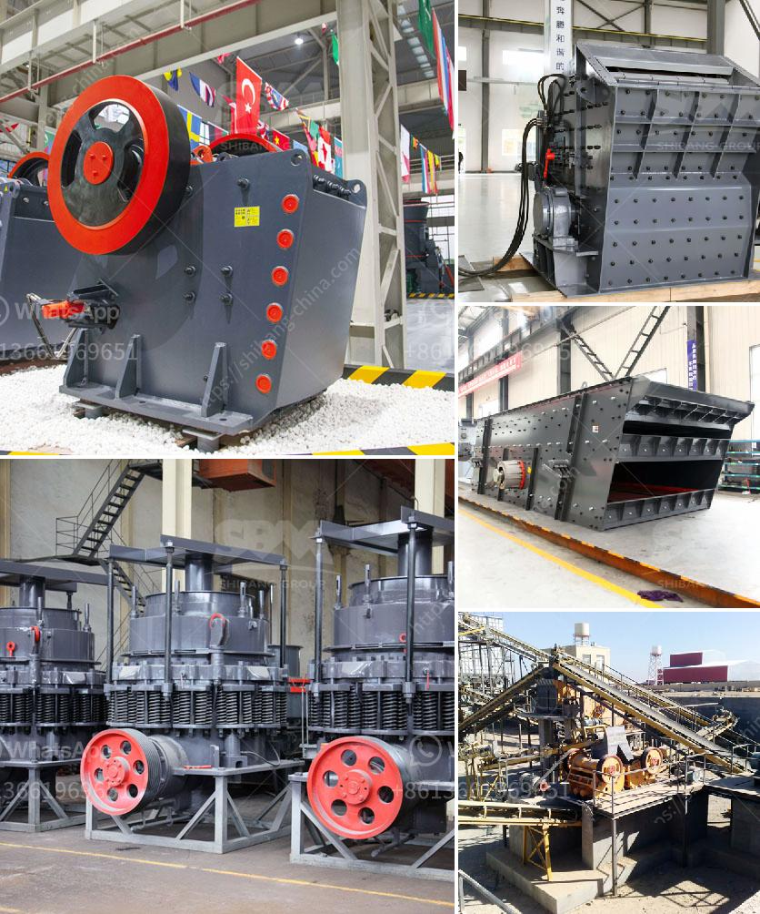

<h3>crushing concrete materials rates in pakistan</h3>
The construction industry in Pakistan is thriving due to the increasing population and urbanization. As a result, there is a huge demand for infrastructure development, housing projects, and commercial buildings, which leads to the use of concrete materials. Concrete plays a pivotal role in the construction sector, providing strength and durability to structures.

However, one of the major challenges faced by the construction industry is the availability of quality concrete materials at reasonable rates. In recent years, the price of concrete materials has been a matter of concern in Pakistan. This has led to a significant impact on project costs and hindered the completion of construction projects within the desired timelines.

To address this issue, crushing concrete materials has emerged as a cost-effective solution. Crushing concrete materials involve breaking down large pieces of concrete into smaller sizes suitable for use in construction purposes. This process not only helps in reducing the overall cost of construction but also ensures the availability of quality concrete materials.

One of the primary advantages of crushing concrete materials is the utilization of waste material. In many construction projects, demolished concrete is left unused and often becomes a landfill. By crushing this waste material, it can be recycled and used as a valuable resource. This approach helps in the efficient utilization of natural resources and minimizes environmental pollution.

Moreover, crushing concrete materials offers significant cost savings. Usually, the cost of transporting natural aggregates from quarries to construction sites can be high, adding to the project's overall expense. On the other hand, crushing concrete materials on-site reduces transportation costs and provides a readily available source of materials, thus optimizing construction budgets.

Another benefit of crushing concrete materials is the improvement in the quality of construction. By crushing concrete, the resulting material can be graded and sorted to ensure uniformity in size and quality. This standardized material enhances the strength and durability of the concrete used in construction, leading to longer-lasting structures.

In addition to cost savings and improved quality, crushing concrete materials also contributes to reducing the carbon footprint. The process of crushing concrete consumes less energy compared to the production of natural aggregates from quarries. This results in a lower carbon emission, making it an environmentally friendly option for the construction industry.

To promote the utilization of crushed concrete materials in Pakistan, it is crucial to raise awareness among construction professionals, policymakers, and other stakeholders. Effective communication and education programs can help in highlighting the benefits and cost savings associated with crushing concrete materials.

Furthermore, the government should also play an active role by encouraging the establishment of more crushing plants and providing incentives for the use of recycled concrete materials. This will not only boost the local economy but also address the issue of rising material prices.

Crushing concrete materials rates in Pakistan can undoubtedly revolutionize the construction industry. With more emphasis on recycling and resource optimization, this practice can contribute to sustainable development, cost savings, and the production of high-quality structures. It is time to adopt this innovative approach and make a positive impact on Pakistan's construction sector.
<h3>Contact us</h3><ul><li><strong>Whatsapp:&nbsp;<a href="https://wa.me/8613661969651">+8613661969651</a></strong></li><li><a href="https://swt.shibang-china.com/?git&amp;zhl&amp;crushing concrete materials rates in pakistan"><strong>Online Service(chat now)</strong></a></li></ul><h3>Related</h3><ul><li><a href='ball grinding mill india.md'>ball grinding mill india</a></li><li><a href='quartz grinding plant.md'>quartz grinding plant</a></li><li><a href='tonne stone crusher cost sale.md'>tonne stone crusher cost sale</a></li><li><a href='tons hour gold wash plant.md'>tons hour gold wash plant</a></li><li><a href='barite beneficiation.md'>barite beneficiation</a></li></ul>