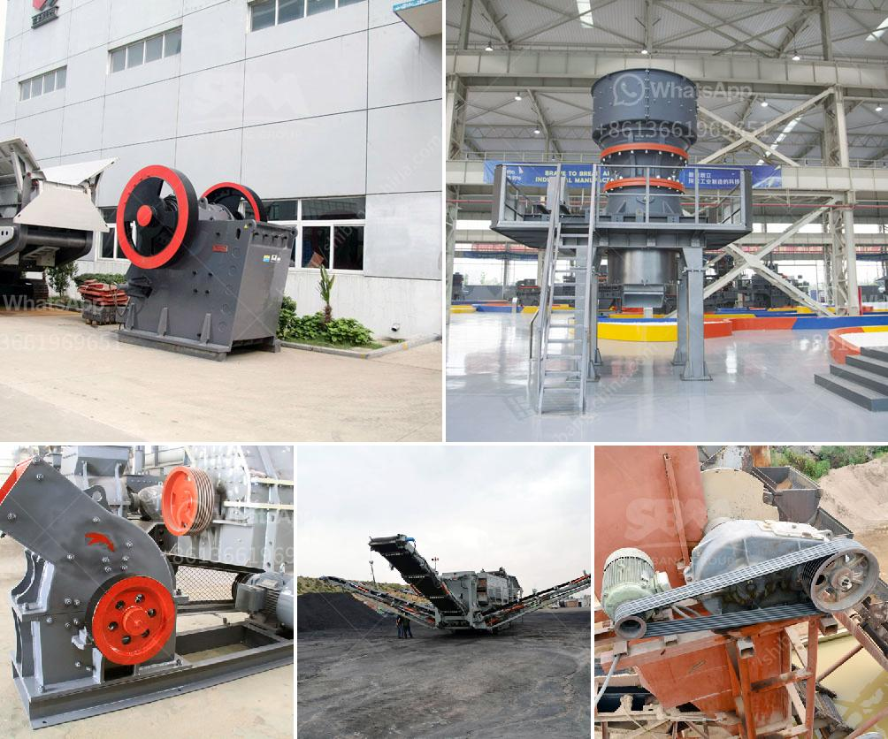

<h3>crushing plant and equipment</h3>
Crushing plants are machines that are used to reduce the size, increase the mobility, and recycle construction waste. Choosing the right crushing plant for the job can greatly reduce costs, and make it easier to recycle materials. A crushing plant is a critical part of most construction projects. It can be used in the primary, secondary, or tertiary stage, depending on the application.

Crushing plants make use of a large range of equipment, such as a pre-screener, loading conveyor, intake hopper, magnetic separator, crushing unit (jaw crusher, cone crusher, etc.), and vibrating screens. These machines work together to process a wide range of materials for a variety of applications.

When choosing a crushing plant, its effectiveness should be evaluated based on factors such as raw material characteristics, project specifications, and the production capacity needed. It is also essential to consider the longevity of the plant to ensure that it will serve the company’s needs for years to come.

One of the primary benefits of a crushing plant is its ability to produce aggregate material for use in the construction industry such as building stones and concrete. This aggregate material can be used as a base material or as a filler for other construction projects.

In addition to its primary function, a crushing plant can also provide various sizes of crushed stone and gravel for various uses by adjusting its crusher settings based on the desired product size. This versatility is crucial for industries such as road construction or building demolition, where different sizes of aggregates are required.

Furthermore, a crushing plant can also be used to recycle construction waste, which can reduce the need for new raw materials. By recycling these materials, companies can help to lower their carbon footprint and contribute to a more sustainable future.

Overall, crushing plants and equipment play a significant role in the construction industry. Not only can they reduce costs for companies, but they can also contribute to the development of more sustainable practices. Therefore, it is crucial for construction companies to carefully consider their crushing plant needs to ensure that it meets their specific requirements and enhances their overall operational efficiency.
<h3>Contact us</h3><ul><li><strong>Whatsapp:&nbsp;<a href="https://wa.me/8613661969651">+8613661969651</a></strong></li><li><a href="https://swt.shibang-china.com/?git&amp;zhl&amp;crushing plant and equipment"><strong>Online Service(chat now)</strong></a></li></ul><h3>Related</h3><ul><li><a href='grinding steel balls for mining.md'>grinding steel balls for mining</a></li><li><a href='impact crusher pioneer chassis mounted.md'>impact crusher pioneer chassis mounted</a></li><li><a href='portable limestone crushing systems.md'>portable limestone crushing systems</a></li><li><a href='horizontal grinding mills price.md'>horizontal grinding mills price</a></li><li><a href='komatsu crawler jaw crusher.md'>komatsu crawler jaw crusher</a></li></ul>