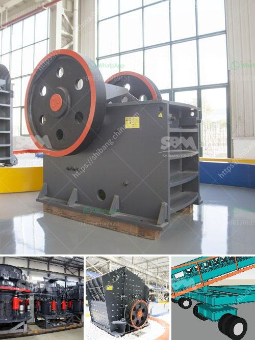

<h3>crushing plant cost</h3>
Crushing plants play a crucial role in the efficient and cost-effective processing of various materials, such as granite, limestone, gravel, coal, and other minerals. Due to their widespread usage, it is important to understand the factors that influence the cost of these plants.

One of the primary factors to consider when calculating the crushing plant cost is the production capacity. Higher capacity plants tend to be more expensive due to their increased size and complexity. However, they also offer higher productivity, faster processing times, and ultimately, greater profitability for the project.

Another major cost element is the type of crushing plant selected. There are various options available, including stationary, portable, and mobile plants. Each type has its own advantages and disadvantages. While stationary plants offer greater stability and durability, portable and mobile plants provide flexibility and versatility. Mobility comes at a higher cost but enables the plant to be relocated easily, offering greater convenience and adaptability for different project sites.

Maintenance requirements also impact the overall cost of a crushing plant. Regular maintenance ensures optimal performance and prevents costly breakdowns or unnecessary downtime. Investing in routine maintenance will pay off in the long run, as it extends the lifespan of machinery and reduces the risk of unexpected failures.

Energy consumption is another important consideration. It is crucial to select energy-efficient equipment to minimize power consumption and reduce operational costs. Modern crushing plants offer various energy-saving features that optimize efficiency and reduce environmental impact.

Lastly, the availability and cost of spare parts should be taken into account. Opting for reputable manufacturers with a reliable supply chain ensures timely access to spare parts at competitive prices. This prevents production delays and excessive expenses in the event of equipment failure or wear and tear.

In conclusion, when evaluating crushing plant costs, it is vital to consider factors such as production capacity, type of plant, maintenance requirements, energy consumption, and spare part availability. By carefully analyzing these factors and making informed decisions, businesses can accurately estimate the cost and choose the most suitable crushing plant for their operations.
<h3>Contact us</h3><ul><li><strong>Whatsapp:&nbsp;<a href="https://wa.me/8613661969651">+8613661969651</a></strong></li><li><a href="https://swt.shibang-china.com/?git&amp;zhl&amp;crushing plant cost"><strong>Online Service(chat now)</strong></a></li></ul><h3>Related</h3><ul><li><a href='crusher manufacturer in gujarat.md'>crusher manufacturer in gujarat</a></li><li><a href='fuel plant stone crusher.md'>fuel plant stone crusher</a></li><li><a href='rock processing plant.md'>rock processing plant</a></li><li><a href='quarry crushing machine.md'>quarry crushing machine</a></li><li><a href='basalt manufacturer crusher machine.md'>basalt manufacturer crusher machine</a></li></ul>