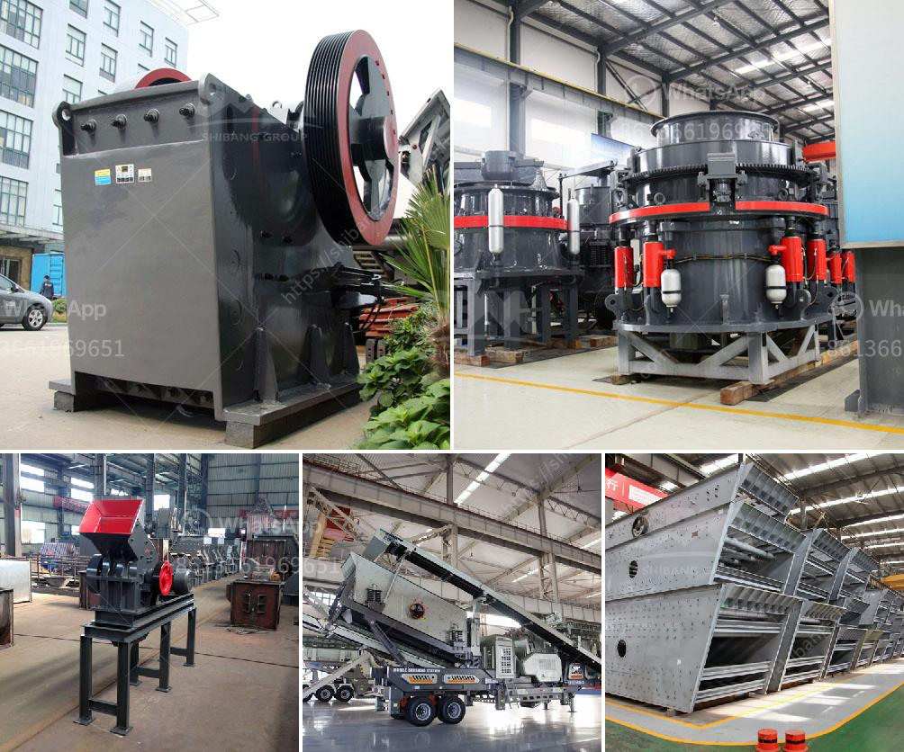

<h3>crushing plant equipment</h3>
Crushing plant equipment, commonly used in mining, metallurgy, chemical and other industries, turns large stones into smaller aggregates by the intensive pressure of rock impacts, compression, and attrition. Complicated crushing operations are required when the rocks are too hard, abrasive, large, or need to be crushed into specific shapes and sizes.

The crushing plant equipment includes jaw crusher, impact crusher, cone crusher, vertical shaft impact crusher (VSI crusher), vibrating feeder, vibrating screen, belt conveyor, and wire mesh conveyor. These crushing machines together form a complete rock crushing plant. The aggregate that is produced by these machines is fine quality and suitable for construction purposes. This is due to its high strength and durability.

In the process of crushing, the machines directly grind the stones by applying forces from both sides of the impacting and grinding actions. Most commonly, the impact crusher is used as the secondary crushing equipment because it can produce cubic-shaped aggregates with very fine size distributions. The cone crusher crushes further and adds another layer of crushing, creating the tertiary crushing process.

One of the main objectives of a crushing plant is to produce aggregates that meet specific criteria for the application. The desired output may require a combination of several machines working together, or even an individual machine with customized features. For example, in the mining industry, a jaw crusher is used to crush large rocks into smaller pieces which are then processed further in a cone or impact crusher. The resulting material is transformed into a final product with specific dimensions and characteristics.

Crushing plant equipment plays a crucial role in the production of aggregates. It not only determines the output quality and quantity but also impacts the economic and environmental benefits of the entire operation. Therefore, the selection of suitable crushing equipment is of great importance. The performance and working efficiency of the equipment depend on its design, manufacturing quality, and operational conditions.

There are several factors to consider when purchasing crushing plant equipment. First, the hardness and abrasiveness of the rock or ore need to be assessed. This will determine the type and hardness of the crushing machinery required, as well as the number and power of the machines needed in the plant. Second, the production capacity requirement should be estimated based on the anticipated volume of raw material input. Furthermore, the specific requirements of the output aggregate, such as size, shape, and quality, should be carefully considered.

In summary, crushing plant equipment plays an important role in the aggregate production process. Choosing the right equipment can greatly improve the production efficiency and output of aggregates, while reducing the operation cost and ensuring high quality. With these tips in mind, your crushing plant equipment is bound to perform optimally, helping you achieve your desired goals.
<h3>Contact us</h3><ul><li><strong>Whatsapp:&nbsp;<a href="https://wa.me/8613661969651">+8613661969651</a></strong></li><li><a href="https://swt.shibang-china.com/?git&amp;zhl&amp;crushing plant equipment"><strong>Online Service(chat now)</strong></a></li></ul><h3>Related</h3><ul><li><a href='mineral processing calculations pdf.md'>mineral processing calculations pdf</a></li><li><a href='crushers for sale saudi arabia.md'>crushers for sale saudi arabia</a></li><li><a href='setting up a coal mining plant.md'>setting up a coal mining plant</a></li><li><a href='stone crushing equipment zenith.md'>stone crushing equipment zenith</a></li><li><a href='used crushers in germany for sale.md'>used crushers in germany for sale</a></li></ul>