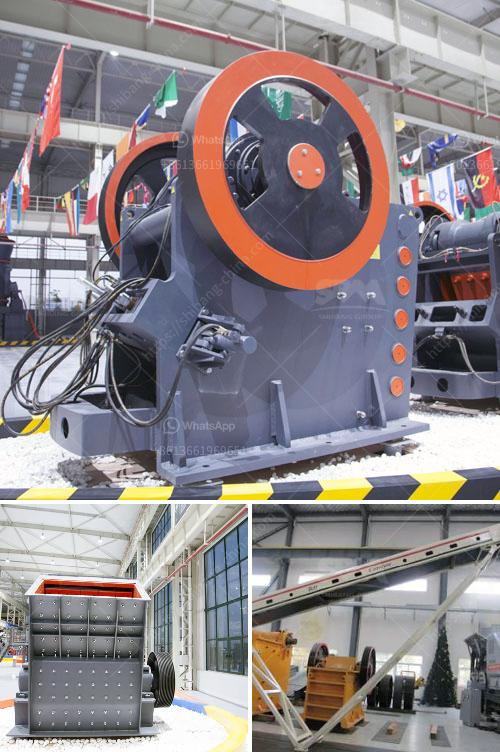

<h3>crushing plant pdf</h3>
A crushing plant is a machine that is used in the construction industry. It helps to crush solid materials such as rocks, gravel, and other aggregates into smaller pieces. The plant itself consists of several components, such as a feeder, a crusher, a screen, and conveyors. Just like other machineries, it needs proper maintenance and regular servicing to prolong its lifespan and ensure its optimal performance.

One of the essential documents related to a crushing plant is the PDF manual. This manual contains all the information about the plant’s operation, maintenance, and troubleshooting. The manual also provides important safety precautions to follow while working with the plant.

The crushing plant PDF manual is designed with specifications and instructions that are specific to a certain model of crushing plant. It provides guidance on maintenance and provides detailed explanations on how to operate the plant safely and efficiently.

One of the main advantages of having a crushing plant PDF manual is that it serves as a reference guide. When operators encounter a problem while operating the plant, they can refer to the manual to find the solutions. This minimizes downtime and reduces the risk of further damage to the plant.

Another benefit of the PDF manual is that it helps operators and maintenance personnel to familiarize themselves with the crushing plant’s components. By understanding the components and their functions, they can identify and rectify any problems that may arise during operation.

The manual also includes information on the recommended maintenance schedule for the crushing plant. Regular maintenance is crucial to ensure that the plant operates at its maximum efficiency. Following the maintenance schedule outlined in the manual can prevent breakdowns and avoid costly repairs.

The PDF manual typically includes detailed diagrams and illustrations of the crushing plant. This visual aid makes it easier for operators and maintenance personnel to understand the plant’s structure and components. They can use these diagrams to locate the parts and make adjustments or repairs as needed.

In summary, a crushing plant PDF manual is an essential tool for operators, maintenance personnel, and anyone involved in the operation of a crushing plant. It provides detailed information on the plant’s operation, maintenance, and troubleshooting. By following the guidelines outlined in the manual, operators can ensure the plant operates efficiently and safely. Regular maintenance and servicing based on the manual’s recommendations can prolong the plant’s lifespan and minimize downtime.
<h3>Contact us</h3><ul><li><strong>Whatsapp:&nbsp;<a href="https://wa.me/8613661969651">+8613661969651</a></strong></li><li><a href="https://swt.shibang-china.com/?git&amp;zhl&amp;crushing plant pdf"><strong>Online Service(chat now)</strong></a></li></ul><h3>Related</h3><ul><li><a href='sand and gravel wash plants usa.md'>sand and gravel wash plants usa</a></li><li><a href='which roller stand in milling industry.md'>which roller stand in milling industry</a></li><li><a href='mini stone crusher machine cost mill.md'>mini stone crusher machine cost mill</a></li><li><a href='ball mill ghana in zambia.md'>ball mill ghana in zambia</a></li><li><a href='limestone grinding mill china.md'>limestone grinding mill china</a></li></ul>